# Abstract Factory

## Overview

Abstract Factory provides an interface for creating **families of related objects**,
without specifying their concrete classes.

The word that carries the pattern is *family*: the products have to be used together and
have to be compatible with each other. Without that compatibility constraint, the pattern
is dead weight.

## Problem

An application needs to create several objects that must belong to the same coherent set,
and mixing sets would produce an error.

The original example is a graphical interface library: buttons, windows and menus all
have to be of the same visual style. A button from one style with a window from another is
a defect.

The guarantee the pattern offers is exactly that: **if you get everything from the same
factory, the objects are compatible by construction.**

## Core Concepts

### The structure

```mermaid
graph TB
  AF["«interface»<br/>AbstractFactory<br/>createA&#40;&#41; · createB&#40;&#41;"]
  F1[Family1Factory] -.implements.-> AF
  F2[Family2Factory] -.implements.-> AF
  F1 -.creates.-> A1[ProductA1] & B1[ProductB1]
  F2 -.creates.-> A2[ProductA2] & B2[ProductB2]
```

The client knows only `AbstractFactory` and the product interfaces. Never the concrete
classes.

### The rigid axis

The pattern's strength is its weakness: **adding a new product to the family requires
altering the factory interface and every implementation.**

Adding a new family is cheap — one class. Adding a product is expensive — it touches every
existing factory.

That means the pattern is only justified when the **set of products is stable** and it is
the families that vary. If it is the other way round, it is the wrong pattern.

### Why it appears so little today

Three reasons.

Modern systems rarely have product families with a rigid compatibility constraint. The
graphical interface case that motivated the pattern is solved today by themes and
stylesheets, not by class hierarchies.

Dependency injection solves the "not knowing the concrete type" problem without grouping
into a factory.

And languages with first-class functions allow passing a set of creation functions, with
no parallel hierarchy.

## When to Use

- There are product families with a **real compatibility constraint** between them.
- The set of products is stable; it is the families that vary.
- The client has to be shielded from knowing the concrete classes.
- Swapping the whole family at runtime or by configuration has value.

## When Not to Use

**When there is no compatibility constraint.** If the products can be mixed with no error,
there is no family — there are independent objects, and each can be obtained by injection.

**When new products are frequent.** Each touches every factory. If that is the expected
variation, the pattern is on the wrong axis.

**When there is only one family.** The whole structure for one implementation.

**When dependency injection solves it.** In most systems with an injection container, the
coherence guarantee can be given by the configuration, with no factory hierarchy.

**As a configuration layer.** Using Abstract Factory to choose between implementations per
environment overlaps something the configuration mechanism already does.

## Alternatives

- **Dependency injection with per-profile configuration** — the answer in most cases.
- **[Factory Method](/03-design-patterns/factory-method.md)** — when it is one product,
  not a family.
- **[Builder](/03-design-patterns/builder.md)** — when the problem is assembling a complex
  object, not choosing between families.
- **Passing a set of creation functions** — the same coherence, with no hierarchy.

## Trade-offs

| Abstract Factory | Direct injection |
|---|---|
| Family coherence guaranteed | Coherence up to the configuration |
| Swapping the family is one line | Swapping touches several points |
| A new product touches every factory | A new product is independent |
| A parallel hierarchy to maintain | No hierarchy |
| Client fully decoupled | Coupling only to the interface |

## Failure Modes

**Single factory.** One family; the whole structure with no variation.

**Bloated interface.** Products added over time, and implementations that return null or
throw for the ones they do not support.

**Factory as a service locator.** The pattern degenerates into an object that returns
anything, and the coupling comes back in disguise.

## Common Mistakes

**Applying it with no compatibility constraint.** The central mistake.

**Confusing it with [Factory Method](/03-design-patterns/factory-method.md).** One creates
a product by subclass; the other creates a family by composition.

**Using it for per-environment selection.** Configuration solves that.

**Ignoring the cost of adding a product.** It is the expensive axis, and it has to be the
rare one.

## Real-World Example

A banking integration system needed to produce, for each bank, a coherent set: a
remittance file formatter, a return parser, an account validator and a check-digit
calculator.

Mixing banks was a real defect and had already happened — one bank's return processed with
another's parser produced incorrect reconciliation for three days.

`BankFactory` with four creation operations, one implementation per bank. The client gets
everything from one factory and cannot mix.

Eleven banks were added over four years, each one a class.

The expensive axis was never exercised: no new product was added to the family in four
years. That was exactly the condition that justified the pattern — a stable set of
products, varying families — and it held.

Had a fifth product emerged, it would have touched eleven classes.

## Where it appears in practice

**XML parsing APIs in Java.** `DocumentBuilderFactory` produces a coherent set of parsing
objects. Mixing components from different implementations would break, and the factory
prevents it.

**Cross-platform widget libraries.** The case that originated the pattern, today solved by
themes in most frameworks.

**Database drivers.** A driver supplies a connection, a statement and a result set
compatible with each other. You do not combine one's connection with another's statement.

The common denominator is the compatibility constraint: the family's objects were designed
to work together and assume things about each other.

In an application system, that condition is rare. When someone proposes Abstract Factory,
the question that decides is direct: **what concretely breaks if we mix objects from
different families?** If there is no specific answer, there is no family — there are
independent objects that can be injected one by one, and the pattern is being used as
organizational grouping, a role it performs badly.

## Related Concepts

- [Factory Method](/03-design-patterns/factory-method.md) — one product, variation by
  subclass.
- [Builder](/03-design-patterns/builder.md) — construction in steps.
- [Facade](/03-design-patterns/facade.md) — when the goal is simplifying access, not
  guaranteeing coherence.

## Practical Exercise

Look in your system for sets of objects that have to be used together and whose mixing
would be a defect.

For each set, check how the coherence is guaranteed today. If it is by convention or by
code review, the pattern may be justified. If it is by explicit configuration, probably
not.

## Interview Questions

- What is the difference between Abstract Factory and Factory Method?
- What kind of change is expensive in this pattern, and why?
- Why does it appear less in modern systems?

## Further Exploration

- Gamma, Erich et al. *Design Patterns*. Addison-Wesley, 1994.
- Fowler, Martin. *Inversion of Control Containers and the Dependency Injection Pattern*,
  2004.
