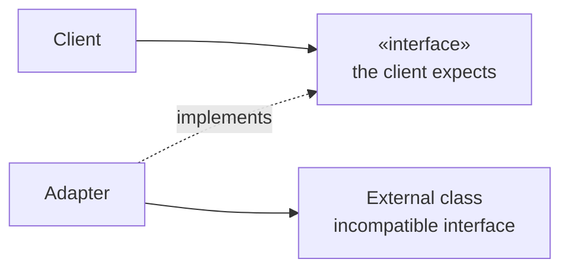

# Adapter

## Overview

Adapter converts one class's interface into another that the client expects, letting
classes with incompatible interfaces work together.

It is the pattern with the greatest practical utility and the least controversy in
the catalogue. It is also the only one that is practically always correct when
applied at the boundary with code you do not control.

## Problem

Your code expects one interface. The library offers another. You control neither —
yours is defined by the domain, theirs by the author.

Three possible responses. Change your code to speak the library's language — which
spreads the dependency everywhere and ties the domain to it. Change the library —
normally impossible. Or translate at a single point.

Adapter is the third. It concentrates the dependency in one place, and it is what
makes it possible to swap the library by changing one file.

## Core Concepts

### The structure

The adapter implements what the client expects and translates to what the external
class offers.

### Adapter is the boundary's defence

This is the architecturally relevant use, and it connects directly to
[Ports and Adapters](/02-software-design/ports-and-adapters.md): the port is the
interface the domain defines; the adapter is what implements it while talking to the
world.

The rule that gives it value: **the library's type does not cross the adapter.** If
the adapter returns the library's `ExchangeRateResponse`, it adapted nothing — it
merely moved the dependency.

### Object adapter and class adapter

The object one composes: the adapter holds a reference to the adaptee. The class one
inherits from both, and only exists in languages with multiple inheritance.

The object one is preferable for the usual reasons of
[composition over inheritance](/02-software-design/composition-vs-inheritance.md).

### Adapter versus Facade

A frequent confusion. **Adapter** makes one interface look like another — the target
already exists and is defined by someone else.
**[Facade](/03-design-patterns/facade.md)** creates a new, simpler interface over a
subsystem — nobody required it before.

Adapter meets an existing contract; Facade invents one.

## When to Use

- Integrating a library or external service whose interface you do not control.
- Isolating the domain from a third-party type.
- Making legacy code satisfy a new interface without altering it.
- Supporting multiple implementations of the same capability — several payment,
  email or storage providers.

## When Not to Use

**When you control both sides.** If both interfaces are yours, align them rather than
translating. The adapter becomes debt.

**When the adapter is a one-to-one delegation with no translation.** If each method
merely forwards with the same name and the same types, it is adapting nothing.

**When it lets the external type leak.** An adapter that returns the library's type
did not isolate.

**As a preventive layer over everything.** Adapting stable platform libraries —
collections, dates — is cost with no benefit. See
[YAGNI](/02-software-design/yagni.md).

**When the incompatibility is semantic, not syntactic.** If the library has a
different conceptual model from yours, the adapter becomes a complex translator that
hides the incompatibility instead of resolving it — and the leak shows up in the edge
cases.

## Alternatives

- **Align the interfaces** — when you control both.
- **An anti-corruption layer** — the same concept at a larger scale, between systems.
  See [DDD](/04-domain-driven-design/index.md).
- **Use the external type directly** — when the dependency is stable and the
  isolation does not pay off.
- **[Facade](/03-design-patterns/facade.md)** — when the goal is to simplify, not to
  make compatible.

## Trade-offs

| Adapter | Direct use |
|---|---|
| Dependency concentrated in one file | Spread out |
| Swapping the library is local | Touches every consumer |
| The domain speaks its own vocabulary | Speaks the library's |
| One class and one translation to maintain | Nothing extra |
| Indirection when reading | Direct |
| Risk of incomplete translation at the edges | No translation |

## Failure Modes

**Type leak.** The dominant mode.

**Anemic adapter.** One-to-one delegation with no translation.

**Lossy translation.** The external model has states yours does not represent, and
the adapter discards them silently.

**Adapter that accumulates logic.** Business rules migrate into it because it is where
the two worlds meet.

## Common Mistakes

**Letting the external type through.** It nullifies the pattern.

**Confusing it with Facade.**

**Adapting what does not need it.** Stable platform libraries.

**Not handling the translation's edge cases.** Null, absence, error and states that do
not exist on both sides.

## Where it appears in practice

**Logging interfaces.** SLF4J in Java is an adapter over several concrete
implementations. The code uses one interface; adapters connect it to Logback, Log4j or
another.

**Database drivers.** JDBC and ODBC are interface specifications, and each driver is
an adapter from a specific database to it.

**Cloud clients.** Libraries offering a single interface over object storage from
different providers.

All three share the characteristic that makes Adapter valuable: **the target interface
was designed first, independently of the implementations**. When the interface is
extracted from an existing implementation, the result is an adapter that only serves
that one — see [interfaces](/02-software-design/interfaces.md).

## Real-World Example

A system integrated with three carriers. Each API had its own model: one returned the
lead time in business days, another in elapsed hours, the third an absolute date.

Without adapters, that difference would be spread across the business rules, with
per-carrier conditionals at several points.

With one adapter per carrier and a domain `Shipping` type — the lead time always as an
absolute date, computed from the business-day calendar when necessary — the rule was
left with a single case.

The edge case that only appeared later is instructive: one of the carriers returned a
negative lead time in error situations. The first adapter propagated that as a date in
the past, and the business rule computed a delay where there was an integration
failure.

The fix was handling that **in the adapter**, translating it into an absent quote. That
is where it should have been from the start: the adapter is responsible for ensuring
that what comes out of it is valid in the domain's model, and not merely for converting
formats.

## Related Concepts

- [Facade](/03-design-patterns/facade.md) — simplify, not make compatible.
- [Bridge](/03-design-patterns/bridge.md) — separate abstraction from implementation by
  design.
- [Proxy](/03-design-patterns/proxy.md) — same interface, additional behaviour.
- [Ports and Adapters](/02-software-design/ports-and-adapters.md).

## Practical Exercise

List your system's external libraries and, for each, count in how many files its types
appear.

The ones appearing in many places are not adapted. Estimate how many files a swap would
touch.

## Interview Questions

- What is the difference between Adapter and Facade?
- What characterizes an adapter that is not adapting?
- Whose responsibility is it to handle the translation's edge cases?

## Further Exploration

- Gamma, Erich et al. *Design Patterns*. Addison-Wesley, 1994.
- Evans, Eric. *Domain-Driven Design*. Addison-Wesley, 2003 — anti-corruption layer.
