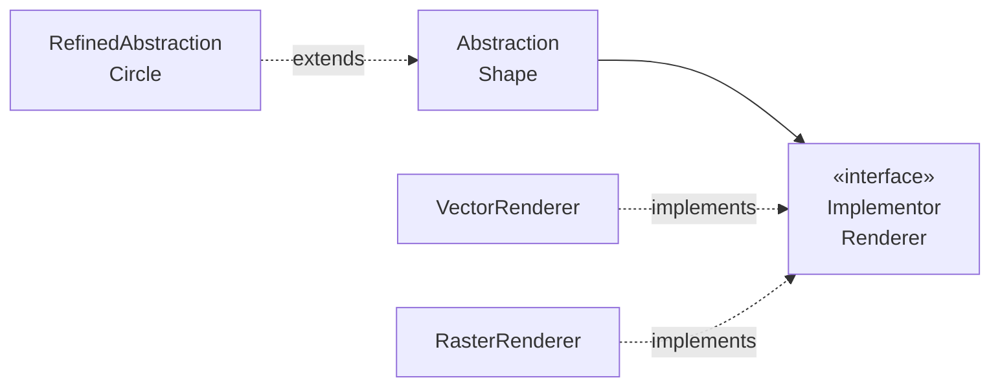

# Bridge

## Overview

Bridge separates an abstraction from its implementation, so the two can vary
independently.

It is the pattern that solves the combinatorial explosion of hierarchies — the problem
that appears when two dimensions of variation are modelled through inheritance.

## Problem

You have two dimensions that vary. Modelled through inheritance, the number of classes
is their product.

```text
2 shapes × 3 renderers = 6 classes

VectorCircle   RasterCircle   ASCIICircle
VectorSquare   RasterSquare   ASCIISquare
```

Adding a shape requires three classes. Adding a renderer requires two. With four shapes
and four renderers, sixteen.

Bridge replaces the product with the sum:

```text
2 shapes + 3 renderers = 5 classes
```

The shape holds a reference to the renderer. The two hierarchies exist separately and
combine by composition.

## Core Concepts

### The structure



The abstraction delegates to the implementor. Note that **the implementor is not the
abstraction's implementation** — it is a second hierarchy, with its own interface, at a
different level of granularity.

### Bridge is not Adapter

A distinction that causes constant confusion.

**[Adapter](/03-design-patterns/adapter.md)** is applied afterwards, to make compatible
things that already exist and were not designed to work together.

**Bridge** is designed beforehand, so that two hierarchies can evolve separately.

The difference is one of intent and of timing: Adapter fixes; Bridge prevents.

### Bridge is not Strategy

Also confused, and the distinction is subtler.

**[Strategy](/03-design-patterns/strategy.md)** swaps an algorithm. The strategy's
interface represents an isolated decision, usually with one method.

**Bridge** separates two structural dimensions. The implementor tends to have several
primitive operations that the abstraction combines.

Structurally alike; the difference is in what varies — an algorithm versus a dimension
of implementation — and in how many operations the interface has.

## When to Use

- Two dimensions of variation that grow independently.
- The implementation has to be swapped at runtime.
- The implementation has to be invisible to the client.
- You are about to create the third or fourth class of a hierarchy that multiplies.

## When Not to Use

**When there is only one dimension of variation.** Simple inheritance or
[Strategy](/03-design-patterns/strategy.md) solve it, and Bridge adds a hierarchy for no
reason.

**When one of the dimensions has a single implementation.** The product has not exploded
yet; see [YAGNI](/02-software-design/yagni.md).

**Preventively.** It is one of the most expensive patterns to apply early, because it
requires designing the implementor's interface — the right primitive operations —
without knowing the real variations. Guessing wrong there produces an interface every
implementor has to work around.

**When the two dimensions are not independent.** If certain combinations make no sense,
the separation is artificial and the code ends up with compatibility checks.

## Alternatives

- **[Strategy](/03-design-patterns/strategy.md)** — when what varies is an algorithm.
- **Simple composition** — pass the dependency with no formal abstraction hierarchy.
- **Inheritance** — while there is only one dimension.
- **First-class functions** — when the implementor has one operation.

## Trade-offs

| Bridge | Inheritance across two dimensions |
|---|---|
| Classes add up | Classes multiply |
| Implementation swappable at runtime | Fixed at compile time |
| Two hierarchies to design | One |
| The implementor's interface has to be right | No intermediate interface |
| Additional indirection | Direct |

## Failure Modes

**Badly chosen implementor interface.** The primitives do not serve every implementor;
some need operations that do not exist, others leave methods empty.

**Non-independent dimensions.** Invalid combinations require runtime checks.

**Bridge with one implementor.** A hierarchy with no variation.

**Implementation leak.** The abstraction exposes the implementor's details, and the
client comes to depend on which one is in use.

## Common Mistakes

**Confusing it with Adapter.** Different timing and intent.

**Confusing it with Strategy.** One dimension versus two.

**Applying it before the explosion.** Wait for the third or fourth class of the product.

**Designing the implementor's interface from one case.** It has to serve all of them.

## Where it appears in practice

**Database drivers.** The `Connection`, `Statement` and `ResultSet` hierarchy is the
abstraction; each driver is an implementation. Both vary: new kinds of operation on one
side, new databases on the other.

**Cross-platform graphics libraries.** The window and drawing abstraction is one
hierarchy; each platform's native graphics system is another.

**Logging abstractions.** The API the code uses is the abstraction; the *appenders* that
write to a file, console or network are the implementors.

The common denominator: in all of them, **whoever designed the implementor's interface
had several real implementations in hand**. That is the condition the pattern demands and
that rarely exists when someone proposes applying it early.

## Real-World Example

A notification system modelled channel and format through inheritance, and reached
twelve classes: `EmailHtml`, `EmailText`, `SmsText`, `PushJson`, `PushText`, and so on.
Half the combinations made no sense and existed as classes that threw.

The separation into Bridge was done **after** the problem appeared, and the implementor's
interface was extracted from the six combinations that actually worked.

Result: four channels and three formats, with an explicit table of which combinations
are valid — because they genuinely are not all independent.

That last point is the most honest thing about the case: Bridge presupposes independence
between the dimensions, and here the independence was partial. The solution ended up
being Bridge with a compatibility check, which is less elegant than the pure pattern and
is what the domain required.

## How to recognize you need it

The most reliable sign is in the class names: **two adjectives coming from different
lists.**

`MonthlyReportPDF`, `AnnualReportPDF`, `MonthlyReportExcel` — "monthly" and "annual"
come from one list, "PDF" and "Excel" from another. The product of the two is the number
of classes.

Three checks that confirm it:

**Count the lists.** If the class names can be generated by combining two or more sets of
words, there is more than one dimension.

**Look for classes that do not exist.** If `AnnualReportExcel` should exist and does not,
or exists throwing, the hierarchy already does not accommodate the product.

**See what a new dimension would cost.** Adding a format requires how many classes? If it
is more than one, the cost is multiplicative.

One important caveat: finding the pattern does not mean Bridge is the answer. If one of
the dimensions has had two stable variants for years, the product is small and
manageable. The pattern pays off when **both** dimensions grow — and growing is a claim
about the history, not about intuition.

## Related Concepts

- [Adapter](/03-design-patterns/adapter.md) — make compatible what already exists.
- [Strategy](/03-design-patterns/strategy.md) — vary an algorithm.
- [Abstract Factory](/03-design-patterns/abstract-factory.md) — frequently used to create
  a coherent abstraction-implementor pair.

## Practical Exercise

Look in your system for hierarchies whose number of classes is the product of two lists —
two adjectives in the class name usually gives it away.

For each, check whether all the combinations are valid. If they are not, pure Bridge does
not apply without additional handling.

## Interview Questions

- What is the difference between Bridge and Adapter?
- And between Bridge and Strategy?
- Why is applying Bridge preventively risky?

## Further Exploration

- Gamma, Erich et al. *Design Patterns*. Addison-Wesley, 1994.
