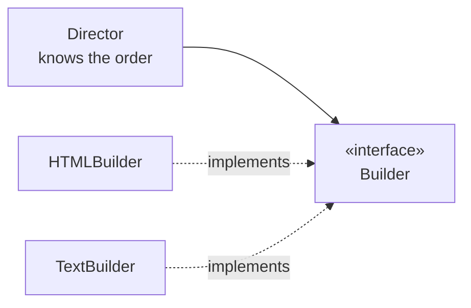

# Builder

## Overview

Builder separates the construction of a complex object from its representation, so
that the same construction process can produce different representations.

In practice, the name covers **two distinct patterns**, and confusing them is the
source of most of the misunderstandings.

## Problem

The original GoF pattern solves a specific case: an assembly process in steps, with a
**director** that knows the order and a **builder** that knows the representation.
Parsing a document and producing HTML or plain text with the same traversal is the
canonical example.

The predominant use today is another: **constructing objects with many optional
parameters**. An object with twelve fields, three of them mandatory, does not fit in a
readable constructor — and a sequence of setters allows invalid states between calls.

Both problems are real. They are different.

## Core Concepts

### GoF Builder — one process, several representations



The director runs the steps in order. Each builder decides what to do with them.
Swapping the builder changes the output without changing the traversal.

### Parameter builder — readable, safe construction

```text
Order.of(customerId, items)      ← mandatory up front
  .withDiscount(discount)
  .withExpressDelivery()
  .withNote(text)
  .build()                       ← validates and constructs at once
```

Two properties that matter: the mandatory ones are required, and the object only
exists after `build()` — there is never a partially assembled instance.

That solves the *telescoping constructor* (a cascade of overloaded constructors) and
the mutable object with setters. See
[encapsulation](/02-software-design/encapsulation.md).

### What decides between the two

If there is **one traversal with several possible outputs**, it is the GoF one. If
there is **one object with many parameters**, it is the modern one.

Applying the GoF one to the second problem produces a director that does nothing.

## When to Use

**Parameter builder:**
- More than four or five parameters, several optional.
- The object should be immutable and valid from creation.
- Combinations of parameters with rules between them.

**GoF Builder:**
- The same construction traversal has to produce different representations.
- The order of the steps is known and stable, and the representation varies.

## When Not to Use

**When there are few parameters.** Two or three mandatory ones fit in a constructor.
The builder adds code and indirection.

**When the language has named parameters with default values.** In Python, Kotlin, C#
and others, the problem the parameter builder solves is already solved by the
language, and the pattern becomes ceremony.

**When the object is genuinely mutable.** If it will change after creation, the
guarantee of validity at construction does not buy what it promises.

**When the director has nothing to direct.** Applying the GoF Builder with no
alternative representations produces a class with no function.

**For transport objects.** A DTO with ten fields that merely carries data does not need
a builder — it needs a transparent record.

## Alternatives

- **Named parameters with defaults** — if the language offers them, it is superior.
- **A parameter object** — group the related ones into their own type.
- **Named factory methods** — when the valid combinations are few and known:
  `Order.expressFor(customer)`.
- **A simple constructor** — when the parameters are few.

## Trade-offs

| Builder | Direct constructor |
|---|---|
| Readable, self-explanatory call | Obscure positional order |
| Object valid and immutable at the end | Intermediate states possible |
| Optionals without combinatorial overloads | Cascade of constructors |
| One extra class per type | Nothing extra |
| Risk of forgetting `build()` | No such possibility |

## Failure Modes

**Exposed mutable builder.** The builder is passed around and altered in several
places before building.

**Validation only at the end, too late.** The error appears far from the call that
caused it. Validating each step where possible helps.

**Empty director.** GoF Builder with no alternative representations.

**Builder generated for everything.** Tools that generate a builder for every class
produce code nobody needs.

## Common Mistakes

**Calling the parameter builder "the GoF Builder pattern".** They are different
problems.

**Using it in a language with named parameters.** Ceremony over a language feature.

**Letting partial state escape.** The object should only exist complete.

**Applying it to DTOs.** With no invariant to protect, there is nothing to guarantee.

## Real-World Example

A `ReportQuery` class accumulated fifteen fields over two years: period, filters,
groupings, ordering, format, limits.

The constructor had seven overloads. Three of them differed only in the order of
parameters of the same type, and a production defect came from exactly that: someone
swapped `startDate` with `endDate` in a call, and the compiler did not complain
because both were the same type.

The builder solved it in two ways. The names made the swap visible on reading. And
`build()` came to validate that the start precedes the end — validation that
previously existed nowhere because there was no single construction point.

The honest detail: had the system been in a language with named parameters, the first
half of the benefit would have come for free, and only the central validation would
remain — which would not justify the extra class.

## Where it appears in practice

**`StringBuilder`.** It is neither the GoF pattern nor the parameter builder — it is
efficient accumulation with chaining. The shared name confuses, and it is worth
knowing these are three distinct things with the same word.

**HTTP clients.** `HttpRequest.newBuilder().uri(...).header(...).build()` is the
parameter builder: many optionals, an immutable object at the end.

**Query builders.** Fluent interfaces that assemble SQL in steps are the GoF Builder
when the same traversal produces different dialects.

**Test libraries.** Constructing complex domain objects in test scenarios is one of the
highest-return uses, because the test becomes readable: what is particular about the
scenario is explicit, and the rest takes defaults.

That last use often justifies the builder on its own, even when production code would
not need it — the test's readability is what makes someone consult it as
documentation.

## Related Concepts

- [Factory Method](/03-design-patterns/factory-method.md) — creation by subclass.
- [Abstract Factory](/03-design-patterns/abstract-factory.md) — families of products.
- [Composite](/03-design-patterns/composite.md) — Builder is frequently used to
  assemble composite structures.
- [Encapsulation](/02-software-design/encapsulation.md) — the invariant the builder
  protects.

## Practical Exercise

Find the class in your system with the most parameters in its constructor. Count how
many are of the same type and adjacent — each such pair is a silent swap waiting to
happen.

Then check whether the language you use has named parameters. If it does, compare the
builder solution with the language's.

## Interview Questions

- What are the two problems the name "Builder" covers?
- When is the parameter builder unnecessary?
- What guarantee does the builder give that a sequence of setters does not?

## Further Exploration

- Gamma, Erich et al. *Design Patterns*. Addison-Wesley, 1994.
- Bloch, Joshua. *Effective Java*. 3rd ed., 2018 — the parameter builder.
