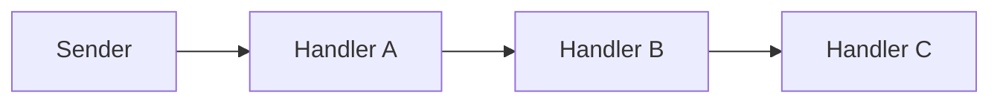

# Chain of Responsibility

## Overview

Chain of Responsibility passes a request along a chain of handlers. Each one decides
whether to handle it or pass it on.

The gain is decoupling the sender from the handler: the sender does not know which
element of the chain will respond, nor whether any will.

That last part — **nor whether any will** — is the pattern's central risk.

## Problem

A request can be handled by several candidates, and which one is right depends on the
request.

Without the pattern, the sender has to decide: a conditional that knows every handler
and each one's conditions. Adding a handler touches the sender.

With the chain, the sender knows only the first link.

## Core Concepts

### The structure

There is a single path from the sender to Handler C, and every arrow is of the same
kind: nothing in the drawing tells a handler apart from a forwarder.

Each handler holds a reference to the next. It examines the request, handles it if it
is within its scope, or passes it on.

### Two different semantics

The name covers two behaviours worth distinguishing.

**First to handle stops.** The classic semantics: the chain is walked until someone
takes it. Used in request dispatch and exception handling.

**Everyone processes.** Each link does something and passes on; nobody interrupts. It
is the middleware model — authentication, logging, compression. Structurally identical
to [Decorator](/03-design-patterns/decorator.md), and the difference in name is
historical.

Confusing the two produces chains where someone interrupts by accident, or where
everyone processes when only one should.

### The end-of-chain problem

What happens if nobody handles it?

The pattern does not answer, and that omission is the source of most of the defects:
the request disappears silently.

Under the "first to handle stops" semantics, the fix is **a final handler that always
handles** — even if only to log and raise an error. A chain without that link has an
invisible failure path.

Under the "everyone processes" semantics the problem does not exist: there is no "nobody
handled it", because nobody was supposed to interrupt. A log event that no *appender*
processes is the designed behaviour.

### Order is a hidden dependency

The handlers' order determines the behaviour and is normally declared nowhere other
than in the chain's assembly.

The same problem as [Decorator](/03-design-patterns/decorator.md), and with the same
fix: the assembly should live in one place, not be distributed.

## When to Use

- Several possible handlers, with scope determined by the request.
- The set of handlers changes at runtime or by configuration.
- The sender should not know who handles.
- Several independent steps need to process the same request.

## When Not to Use

**When the handler is always the same.** Call it directly.

**When the selection is by a known value.** A dispatch table — a map from key to
handler — is more direct, faster and easier to audit than walking a chain.

**When handling has to be guaranteed and the chain does not guarantee it.** Without a
final link, the request vanishes.

**When the order has complex rules.** The pattern does not express them.

**When tracing matters.** Finding out which link handled it requires instrumentation;
in a critical flow, that costs.

## Alternatives

- **A dispatch table** — when the selection is by key. Simpler and more explicit.
- **Middleware with a declared order** — for the "everyone processes" semantics.
- **An explicit conditional** — when there are few stable handlers, and readability
  matters more than decoupling.
- **[Mediator](/03-design-patterns/mediator.md)** — when the coordination is between
  objects, not a linear chain.

## Trade-offs

| Chain | Conditional in the sender |
|---|---|
| Sender does not know the handlers | Knows all of them |
| A new handler does not touch the sender | Touches it |
| Implicit, fragile order | Explicit |
| A gap spread across the chain | A gap concentrated and visible in the sender |
| Traversal to trace | Direct flow |

## Failure Modes

**Unhandled request.** The dominant mode.

**Wrong order.** A generic handler before a specific one captures everything.

**Broken chain.** A link forgets to pass on.

**Cycle.** A handler points to an earlier one; infinite traversal.

**Invisible linear cost.** A long chain walked on a hot path.

## Common Mistakes

**Having no final link.** Always have one that handles or fails explicitly.

**Confusing the two semantics.**

**Using it where a dispatch table solves it.**

**Assembling the chain in several places.** The order has to live in one place.

## Where it appears in practice

**HTTP middleware.** The "everyone processes" semantics, with the possibility of
interrupting — authentication that rejects before reaching the controller.

**Exception handling in languages.** The nearest matching `catch` handles it;
otherwise it propagates. It is the "first to handle" semantics, built in.

**Application server filters.** A chain configured declaratively, with an explicit
order.

**Logging with levels.** An event goes through *appenders* that decide whether to
process it.

The exceptions case is instructive: the language supplies a default final handler, which
**reports** instead of letting the case vanish. On the main path that usually terminates
the program with a visible error; off it the behaviour varies — in Java and in Python, an
unhandled exception on a secondary thread kills only that thread, and the process carries
on. It is the guarantee manual implementations forget, and the secondary-thread case shows
that not even the language gives it for free in every context.

## Real-World Example

An expense approval system used a chain: manager, director, finance, board, each with
an approval limit.

The defect appeared with an expense above the board's limit — a case nobody had
foreseen. The chain ended, no link handled it, and the expense was left in a state with
neither approval nor rejection. There was no screen that showed it.

It sat there for five weeks until someone asked.

The fix was a final link, `ApprovalNotDefined`, which records the case, notifies
administration and marks the expense as pending a manual decision.

What changed was not the pattern — it was admitting that the chain can end without
handling, and making that an explicit case rather than silence.

## Two ways to implement it

The classic structure — each handler referencing the next — is not the only one, and
the alternative is usually better.

**Linked list.** Each handler holds the next and decides whether to pass on. It is the
GoF form. The handler controls the flow, which allows pre- and post-processing around
the next call — necessary for middleware.

Cost: assembling the chain requires chaining objects, and the structure is only visible
by walking the references.

**Iterated collection.** A coordinator holds the list of handlers and walks it until
one takes over. The handlers do not know each other.

Cost: it loses the pre- and post-processing around the next one, because the handler
does not call the next.

| | Linked list | Iterated collection |
|---|---|---|
| Handlers know each other | Yes | No |
| Wrapping the next | Possible | No |
| Order visible | By walking references | In a list |
| Reordering | Rechain | Reorder the list |
| Suited to | Middleware | Dispatch by type |

For the "first to handle stops" semantics, the iterated collection is almost always
simpler and easier to audit. The linked list is necessary when the handler needs to do
something after the following ones finish.

## Related Concepts

- [Decorator](/03-design-patterns/decorator.md) — same structure, "everyone processes"
  semantics.
- [Command](/03-design-patterns/command.md) — what travels along the chain can be a
  command.
- [Mediator](/03-design-patterns/mediator.md) — non-linear coordination.

## Practical Exercise

If your system has handling chains, answer for each: is there a final link that always
handles? What happens today if no handler takes it? Where is the order declared?

## Interview Questions

- What are the two semantics this pattern covers?
- What happens if no handler takes it, and whose responsibility is that?
- When is a dispatch table preferable?

## Further Exploration

- Gamma, Erich et al. *Design Patterns*. Addison-Wesley, 1994.
