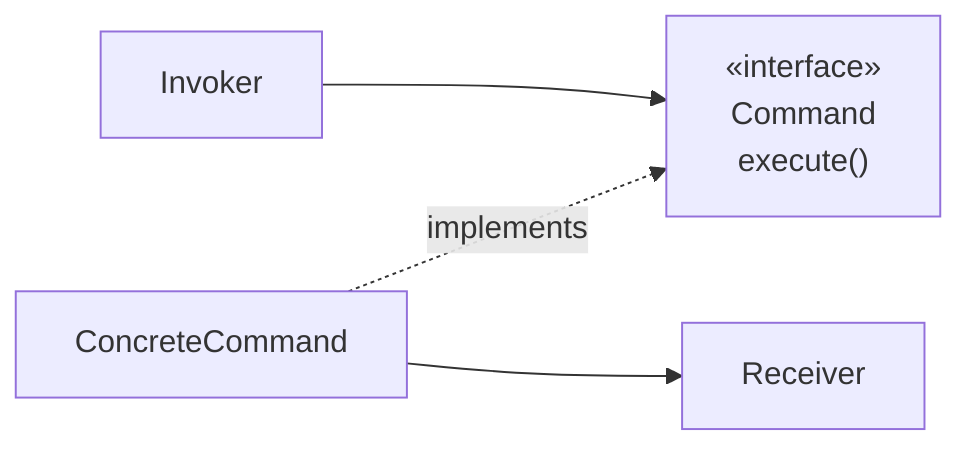

# Command

## Overview

Command encapsulates a request as an object, allowing clients to be parameterized,
operations to be queued, logged and undone.

The central idea is **reification**: turning an action — normally a method call,
ephemeral — into data that can be stored, transmitted and manipulated.

## Problem

A method call happens and disappears. That is sufficient most of the time, and
insufficient when you need to:

Undo — you need to know what was done and how to reverse it.
Queue — the operation has to run later, or in another process.
Log — for auditing or reprocessing.
Compose — group several operations into one logical transaction.
Retry — re-execute on failure.

All of those require the operation to **exist as a thing**, not as a past event.

## Core Concepts

### The structure

Only one box carries the «interface» stereotype, and it is Command's — the Receiver is
an ordinary class that need not know a command exists.

The command holds the receiver and the parameters. The invoker only knows
`execute()` — and so it can queue, log or schedule without knowing what the command
does.

### Undo is the hard part

`undo()` looks like a simple addition and is not.

Each command has to know how to reverse its effect, and not every operation is
reversible. Sending an email is not. Charging a card requires a refund, which is
another operation with its own failures.

Two strategies:

**Logical inverse** — the command knows the opposite operation. Compact, and it
requires each command to implement its own correctly — including at the edges.

**Previous state** — the command stores the state before executing and restores it.
See [Memento](/03-design-patterns/memento.md). Simpler to get right, and more
expensive in memory.

The choice depends on the size of the state and how reliable it has to be.

### Command and CQRS

The separation between commands that change state without returning data and queries that
return without changing is Meyer's (1988), and it is level 1 of
[CQRS](/03-design-patterns/cqrs.md) — it does not come from this pattern, despite the
coincidence of names.

What the Command pattern adds is **reification**: turning the operation into an object.
That is why it shows up in the implementation of the write side — a command you can queue,
log or replay — but the separation would exist without it.

That separation of intent is useful even without adopting CQRS as an architecture.

## When to Use

- Undo or redo is necessary.
- Operations have to be queued or scheduled.
- Operations have to be logged for auditing or reprocessing.
- Several operations have to be treated as one unit.
- The invoker should not know what the operation does.

## When Not to Use

**When the operation is executed immediately and once.** Call the method.

**When there is no need for undo, queuing or logging.** Those needs are what pay for
the pattern.

**When undo cannot be implemented reliably.** An undo that works in the common case
and fails at the edges is worse than no undo — the user trusts it.

**When it produces one class per method.** If each operation becomes a trivial command
with none of the needs above, the pattern added files.

**When the language has first-class functions and there is no state to store.** A
function capturing the context is a command.

## Alternatives

- **A function or closure** — when nothing more than executing later is needed.
- **[Memento](/03-design-patterns/memento.md)** — for undo by state restoration.
- **An event log** — when the goal is auditing, recording what happened can be simpler
  than reifying the action.
- **A message queue** — when the operation has to cross processes.

## Trade-offs

| Command | Direct call |
|---|---|
| The operation can be stored and transmitted | Ephemeral |
| Undo and redo possible | Not |
| Invoker decoupled | Knows the operation |
| One class per operation | None |
| Command state to manage | No state |

## Failure Modes

**Incomplete undo.** Reverts the main effect and not the side effects.

**Command with a stale reference.** The receiver changed between creation and
execution, and the command acts on state that no longer exists.

**Unbounded undo stack.** A memory leak.

**Non-serializable command.** Holds references that do not survive persistence or
transmission.

**Partially executed composite.** A composite command fails midway, and undoing the
earlier ones may fail too.

## Common Mistakes

**Implementing undo without covering the edge cases.**

**Creating a command for every operation.**

**Storing a reference to the object instead of an identifier.** It prevents
persistence and causes behaviour over stale state.

**Not bounding the undo stack.**

## Where it appears in practice

**Editors.** Undo and redo is the canonical use, and the one that most demands rigour
in the inverse.

**Task queues.** A queued job is a serialized command: the operation name plus
parameters.

**Menus and keyboard shortcuts.** The same command triggered through different paths,
without each path knowing the operation.

**Database transactions and migrations.** A migration with `apply` and `revert` is
Command with undo.

The queue case is the most frequent in business systems, and it is where serialization
becomes the dominant requirement — a command holding references to live objects cannot
be queued.

## Real-World Example

An architectural floor plan editor needed undo with unlimited depth.

The first implementation used the logical inverse: each command knew how to revert. It
worked for move and resize. It broke on "group elements": undoing needed to restore not
only the structure, but the original stacking order — which the command did not store.

The second implementation used previous state, but storing the whole document on every
operation consumed too much memory.

The final solution was hybrid, and it is the interesting part: commands with a reliable
and cheap inverse — move, resize, change colour — use the logical inverse. Structural
commands — group, ungroup, paste — store the state of the affected region.

The decision became per command, with a declared criterion: *use the logical inverse
when it is demonstrably complete; otherwise, store the state.*

There is no single answer for the whole pattern.

## Related Concepts

- [Memento](/03-design-patterns/memento.md) — state capture for restoration.
- [State](/03-design-patterns/state.md) — commands frequently trigger transitions.
- [CQRS](/03-design-patterns/cqrs.md) — the command/query separation at architecture
  scale.

## Practical Exercise

If your system has undo, pick three operations and check whether the undo covers every
effect — including the side effects and the edge cases.

If it does not, list the operations that would benefit from queuing, logging or
composition. Only those justify the pattern.

## Interview Questions

- What capabilities does reifying an operation open up?
- What are the two undo strategies and how do you choose?
- Why should a command not store a reference to the object?

## Further Exploration

- Gamma, Erich et al. *Design Patterns*. Addison-Wesley, 1994.
- Meyer, Bertrand. *Object-Oriented Software Construction*, 1988 — the separation
  between command and query.
