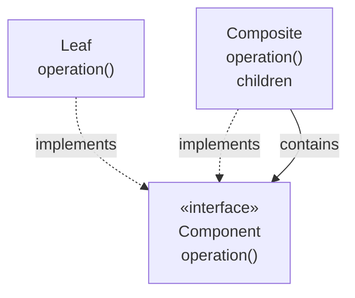

# Composite

## Overview

Composite organizes objects into tree structures and lets the client treat individual
objects and compositions uniformly.

The gain is specific: **the client no longer needs to know whether it is dealing with
a leaf or a node.** Where there were conditionals, there is now one call.

## Problem

A hierarchical structure in which an element may contain others of the same type:
directories with files and subdirectories, groups of graphical elements, menu items
with submenus, expressions with subexpressions.

Without the pattern, all code that walks the structure has to distinguish:

```text
if it is a file:       add its size
if it is a directory:  for each child, repeat
```

That conditional replicates in every operation — compute size, render, count, search.
Adding a node type requires touching all of them.

## Core Concepts

### The structure

Look at where the `contains` arrow points: at the interface, not at the composite.
Either implementer can be a child.



The composite implements the same interface as the leaf and delegates to the
children. The recursion sits inside the structure, not in the client.

### The central decision: uniformity or safety

The GoF presents two variants, and choosing between them is the pattern's trade-off.

**Transparent** — the `Component` interface declares `add` and `remove`. The client
treats everything the same; the leaf has to deal with operations that make no sense
for it, typically by throwing.

**Safe** — only the composite has `add` and `remove`. There is no meaningless
operation; the client has to check the type in order to compose.

Transparent wins on uniformity and loses on type safety; safe, the reverse. The choice is
binary when the interface has to be closed and the platform offers no safe query — outside
that there is a middle ground: a query accessor, `asComposite()`, returning empty on the
leaf. It preserves the uniform traversal and gives whoever composes a total check, with no
`instanceof`; in a language with sealed types and pattern matching, the cost of that check is
lower still.

Either way, choosing requires knowing whether the client composes or merely traverses.

When the client only traverses, the safe variant costs nothing and is preferable.

### Composite and recursion

The structure is naturally recursive, and that brings two real concerns: depth — the
stack in very deep trees — and cycles, which produce infinite recursion if the
structure allows a node to contain an ancestor.

## When to Use

- There is a genuine part-whole hierarchy in the domain.
- The client should treat leaves and compositions identically.
- Operations apply recursively to the whole structure.
- New leaf types appear frequently.

## When Not to Use

**When the hierarchy is not part-whole.** Inheritance is not composition. If a type
does not contain others of the same type, the pattern does not apply.

**When leaf and composite have very different behaviour.** Forcing a common interface
produces meaningless methods on one side, and the client ends up checking the type
anyway — losing the benefit and keeping the cost.

**When the structure is shallow and fixed.** Two known levels do not justify the
generality.

**When type safety matters more than uniformity.** See the decision above.

**When operations need context from the path.** If a node's behaviour depends on who
its ancestors are, the uniformity breaks and the pattern starts getting in the way.

## Alternatives

- **A simple list** — when the structure is shallow.
- **[Visitor](/03-design-patterns/visitor.md)** — when the operations vary more than
  the node types; frequently used together with Composite.
- **[Iterator](/03-design-patterns/iterator.md)** — when traversal is the only need.
- **A data structure with no class hierarchy** — a generic tree with data in the
  nodes.

## Trade-offs

| Composite | Conditional in the client |
|---|---|
| Uniform client | Replicated conditional |
| A new leaf type does not touch the client | Touches every conditional |
| Interface with meaningless operations for leaves | Precise types |
| Encapsulated recursion | Explicit and visible |
| Implicit traversal, hard to control | Full control |

## Failure Modes

**Leaf that throws.** A consequence of the transparent variant, and a declared
[Liskov](/02-software-design/solid.md) violation.

**Cycle in the structure.** Infinite recursion.

**Excessive depth.** Stack overflow in a recursive traversal.

**Empty composite treated as a leaf.** An ambiguity that produces subtle defects.

**Hidden expensive operation.** A simple call walks thousands of nodes, and nothing in
the code suggests it.

## Common Mistakes

**Applying it to an inheritance hierarchy.** It is not the same as a part-whole
hierarchy.

**Choosing the variant without thinking.** It is the pattern's decision.

**Not handling cycles.** If the structure allows one, someone will create it.

**Ignoring traversal cost.** A uniform operation can be O(n) with no warning.

## Where it appears in practice

**GUI trees.** A container is a component that contains components. Rendering,
measuring and propagating events are uniform operations over the tree.

**File systems.** Directories and files with common operations — size, permissions,
path.

**Syntax trees.** An expression contains subexpressions; evaluating is recursive. It
is where Composite and [Visitor](/03-design-patterns/visitor.md) most frequently
appear together.

**Document structures.** The DOM in browsers: nodes containing nodes, with uniform
operations.

In all four, the part-whole hierarchy is intrinsic to the domain — nobody invented it
in order to apply the pattern. That is the sign Composite is appropriate: the tree
already exists in the problem.

## Real-World Example

A permissions system modelled groups containing users and other groups. Checking
whether someone has a permission required recursive traversal.

The first implementation used transparent Composite: `Principal` with `add` and
`remove`, and `User` throwing on both.

The problem appeared when the admin interface started building the structure: it
needed to check the type before composing, which nullified the uniformity — and still
kept the exceptions.

The change to the safe variant removed `add` and `remove` from `Principal`. The
permission-checking code, which only traverses, stayed uniform. The admin code, which
composes, came to work with `Group` explicitly.

It turned out the two clients had different needs, and that the transparent variant
was trying to serve both with a single interface.

A cycle also appeared: an administrator put a group inside one of its descendants. The
check came to track visited nodes, which should have been done from the start.

## Related Concepts

- [Decorator](/03-design-patterns/decorator.md) — similar structure, different
  purpose.
- [Visitor](/03-design-patterns/visitor.md) — operations over the structure.
- [Iterator](/03-design-patterns/iterator.md) — traversal.

## Practical Exercise

Look in your system for structures in which an element contains elements of the same
type.

For each, check: is there a type conditional replicated across the traversals? Does
the structure allow a cycle? How much does the most common operation cost in number of
nodes?

## Interview Questions

- What are Composite's two variants and what is traded between them?
- How does Composite differ from an ordinary inheritance hierarchy?
- What risks does recursion bring in this pattern?

## Further Exploration

- Gamma, Erich et al. *Design Patterns*. Addison-Wesley, 1994.
