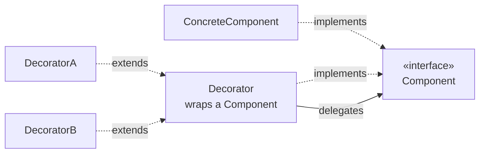

# Decorator

## Overview

Decorator adds responsibilities to an object dynamically, wrapping it in another
object that implements the same interface.

It is the alternative to inheritance for extending behaviour, and it solves the same
combinatorial explosion problem [Bridge](/03-design-patterns/bridge.md) solves — by
another route.

## Problem

An object needs additional behaviours that combine: a data stream that can be
compressed, encrypted, buffered, or any combination of the three.

Through inheritance, three combinable behaviours require eight classes. Four require
sixteen.

Decorator makes the combination additive: one decorator per behaviour, stacked as
needed.

```text
new Buffer(new Compression(new Cipher(baseStream)))
```

## Core Concepts

### The structure



The decorator implements the same interface and holds a reference to the wrapped
object. Each method delegates, adding behaviour before, after, or both.

### The interface has to be preserved

The property that makes the pattern work: **the decorator is indistinguishable from
the original object to whoever uses it.** If it adds methods to the interface, it can
no longer be stacked transparently.

That limits the pattern to behaviours that do not change the contract — logging,
caching, validation, measurement, access control.

### Order matters

Stacking compress-then-encrypt produces a different result from
encrypt-then-compress — and the second compresses badly, because encrypted data is
incompressible.

It is worth rereading the stack above with that in mind: on the write path, the
**outermost** layer processes first. `Buffer(Compression(Cipher(...)))` compresses before
encrypting, which is the right order. Swapping `Compression` and `Cipher` produces no
compilation error, breaks no unit test of either one, and yields a file that takes up the
same space as the original.

The order is a design decision the pattern does not document. Whoever assembles the
stack has to know, and nothing in the code enforces the correct order.

### Decorator is not Proxy

Structurally identical; the distinction is one of intent.

**Decorator** adds behaviour the client wants, and the composition is the client's
choice.
**[Proxy](/03-design-patterns/proxy.md)** controls access to the object, and the
client frequently does not even know it exists.

## When to Use

- Combinable behaviours that are independent of each other.
- The combination has to be decided at runtime or by configuration.
- Extending by inheritance would produce a combinatorial explosion.
- The additional behaviour is cross-cutting and does not alter the contract.

## When Not to Use

**When there is only one combination.** A decorator always applied is one more method
on the class.

**When the additional behaviour changes the contract.** If the decorator needs to
expose something new, it is not transparent and the stack breaks.

**When the order has complex rules.** If certain combinations are invalid or require a
specific order, the pattern does not express that and someone will assemble it wrong.

**When the stack gets deep.** Debugging a chain of six decorators is painful: the call
stack becomes unreadable and there is no place where the complete behaviour is
visible.

**When the platform's mechanism solves it.** Middleware, interceptors and aspects do
the same with less code and with the order declared in one place.

## Alternatives

- **Middleware or interceptors** — the same concept, with the order declared
  explicitly. Preferable in frameworks that offer them.
- **[Strategy](/03-design-patterns/strategy.md)** — when what varies is the algorithm,
  not an additional layer.
- **Direct composition** — pass the dependencies and call them in order.
- **[Proxy](/03-design-patterns/proxy.md)** — when the goal is controlling access.

## Trade-offs

| Decorator | Inheritance |
|---|---|
| Combinations add up | They multiply |
| Decided at runtime | Fixed at compile time |
| Deep stack hard to debug | One class, one place |
| Implicit, fragile order | No order to get wrong |
| Many small objects | Fewer objects |

## Failure Modes

**Deep stack.** Unreadable traces; nowhere shows the complete behaviour.

**Wrong order.** A syntactically valid and semantically wrong combination.

**Decorator that breaks transparency.** Adds methods or alters semantics.

**Lost identity.** Equality comparison or type checking fails, because the visible
object is the decorator and not the original.

**Invisible accumulated cost.** Each layer adds a call; on a hot path with six layers,
that shows.

## Common Mistakes

**Confusing it with Proxy.** Different intent.

**Applying it with only one combination.**

**Not documenting the correct order.** It is the information the pattern does not
carry.

**Using it where middleware exists.** Reimplementing what the framework offers.

## Where it appears in practice

**Java input and output streams.** The canonical example:
`new BufferedReader(new InputStreamReader(new FileInputStream(f)))`. It is also the
example that draws the most criticism — the verbosity and the need to know the correct
order are cited as the cost of the pattern taken too far.

**HTTP middleware.** Authentication, logging, compression and rate limiting stacked.
Here the order is declared in one place, which fixes the pattern's main weakness.

**Synchronized or immutable collections.** They wrap a collection and add behaviour
while preserving the interface.

**HTTP clients with retry and caching.** Each concern is a layer.

The comparative lesson: the pattern is the same in all four, but where the order is
declared centrally — middleware — it works far better than where each caller assembles
it.

## Real-World Example

A client for an external service accumulated: retry with backoff, a circuit breaker,
caching, structured logging and latency measurement.

Implemented as decorators, each in its own class, assembled in configuration.

It worked well for a year. The problem arose when a new team member assembled the
stack in a different order for a second service: they put caching **after** retry.

The effect: transient failures were retried, and the final error response entered the
cache. A two-second outage became five minutes of errors served from cache.

The fix was not merely reordering. It was extracting an assembly function —
`standardClient(target)` — that builds the stack in the correct order and is the only
supported path.

The pattern stayed; what changed was taking the ordering decision out of the hands of
whoever assembles. It is the same fix middleware offers by construction.

## How to keep the stack debuggable

The most valid criticism of the pattern is the unreadable trace: a stack of six
decorators produces a call chain in which nothing indicates what each layer does.

Four practices that reduce that significantly:

**Name the decorators by behaviour, not by the object.** `RetryingClient` says more
than `RetryDecorator` in a call stack.

**Concentrate the assembly in a named function.** A `standardClient()` that builds the
correct stack is the only place where the order exists, and it becomes executable
documentation.

**Log entry and exit of each layer with the same correlation identifier.** That
reconstructs the passage through the stack in the logs, which is where production
debugging happens.

**Expose the composition.** A method that describes the assembled stack — the layer
names, in order — allows checking at runtime what is active. It costs ten lines and
answers the question that comes up most in an incident.

The structural alternative remains middleware, where the framework already offers all
four.

## Related Concepts

- [Proxy](/03-design-patterns/proxy.md) — same structure, intent of control.
- [Composite](/03-design-patterns/composite.md) — a similar recursive structure.
- [Chain of Responsibility](/03-design-patterns/chain-of-responsibility.md) — a chain
  with stopping semantics.
- [Strategy](/03-design-patterns/strategy.md) — algorithm variation.

## Practical Exercise

Look in your system for stacks of objects that wrap each other — HTTP clients,
repositories with caching, streams.

For each stack, answer: does the order matter? Where is it documented? What happens if
someone assembles it differently?

## Interview Questions

- What is the difference between Decorator and Proxy?
- Why is the order of decorators a risk?
- When is middleware preferable to decorators?

## Further Exploration

- Gamma, Erich et al. *Design Patterns*. Addison-Wesley, 1994.
