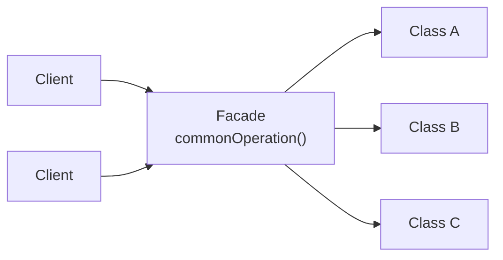

# Facade

## Overview

Facade provides a unified, simple interface to a set of interfaces in a subsystem.

The success criterion is single and verifiable: **the client needs to know less.** If
using the facade requires knowing the subsystem behind it, it is not doing its job.

## Problem

A subsystem has many classes, and carrying out a common operation requires
coordinating several of them in the right order, with intermediate state.

Each client that needs that operation replicates the sequence. The order, the
parameters and the error handling spread out, and changing the subsystem touches
every client.

Facade concentrates the sequence in one place and exposes the operation as a single
call.

## Core Concepts

### The structure

The facade does not prevent direct access to the subsystem — it offers a simpler path
for the common case. Whoever needs fine control can still use the classes underneath.

That is an important property and frequently lost: **a facade is convenience, not a
blockade.** A facade that hides everything and leaves no alternative becomes a
bottleneck when someone needs what it does not expose.

### Facade is not Adapter

**[Adapter](/03-design-patterns/adapter.md)** makes one interface look like another
that already exists and is defined by a third party. **Facade** creates a new
interface, which nobody required, in order to simplify.

Adapter meets a contract; Facade invents one.

### A facade is not a mandatory layer

A common mistake is turning a facade into a layer everything must pass through. That
changes its nature: it stops being convenience and becomes control, and the facade
accumulates methods until it is an object that does everything.

The symptom: an `OrderService` class with forty public methods, on which the whole
system depends.

## When to Use

- A subsystem requires repeated sequences of calls.
- Several clients need the same composed operation.
- It is desirable to reduce coupling between the clients and the internal classes.
- A legacy subsystem needs a simpler entry point while it is being modernized.

## When Not to Use

**When the subsystem is already simple.** A facade over two classes is indirection.

**When each client needs something different.** With no common operation, the facade
accumulates methods with no cohesion — and becomes a `utils` under another name.

**When it becomes the only path.** Blocking direct access turns the convenience into a
bottleneck.

**When it accumulates business rules.** It is the most common degeneration: the facade
starts by coordinating and ends up deciding. See
[cohesion](/01-fundamentals/cohesion.md).

**As a mandatory layer by architectural convention.** Facades created out of symmetry,
one per module, with no real composed operation, are anemic layers.

## Alternatives

- **A convenience function** — when it is one operation, a function is enough.
- **An application service** — in architectures with explicit use cases, it already
  plays that role.
- **[Mediator](/03-design-patterns/mediator.md)** — when the goal is coordinating
  objects that interact with each other, not simplifying access.
- **Improving the subsystem** — if it is too complex to use, sometimes the answer is
  fixing that, not wrapping it.

## Trade-offs

| Facade | Direct access |
|---|---|
| Client knows less | Client knows the subsystem |
| Sequence in one place | Replicated |
| An internal change does not touch clients | Touches all of them |
| One more class | No intermediary |
| Risk of becoming an object that does everything | No such risk |
| Uncommon cases may not be covered | Full control |

## Failure Modes

**Facade that does everything.** Dozens of methods, universal dependency, no
cohesion.

**Facade with business rules.** It stopped coordinating and started deciding.

**Mandatory facade.** Becomes a bottleneck for unforeseen cases.

**Anemic facade.** Each method forwards one call, composing nothing.

**Subsystem leak.** The internal types appear in the facade's signature, and the
client stays coupled.

## Common Mistakes

**Confusing it with Adapter.**

**Creating one per module, out of symmetry.** With no composed operation, it is an
anemic layer.

**Letting it accumulate methods.** Every facade tends to grow; without review, it
becomes the system's central object.

**Blocking direct access.** Convenience, not control.

## Where it appears in practice

**Cloud SDK clients.** A class offering `uploadFile(path)` over the sequence of
credentials, session, client, multipart upload request and confirmation.

**High-level library APIs.** Many libraries offer a simple layer over a low-level one
— and keep both accessible, which is the correct form.

**Application services.** In Clean Architecture and Onion, the application service
works as a facade over the domain for the inbound adapters.

The common pattern in all three: **the low-level interface stays available**.
Libraries that completely hide the lower layer end up generating feature requests the
author has to expose one by one — which is the symptom of a mandatory facade.

## Real-World Example

A system integrated with an ERP whose API required, to query an order: open a session,
authenticate, select the company, select the branch, build the filter, run the query,
paginate, and close the session.

Eight calls, with state between them, replicated in six places — with variations,
because each developer had copied from a different point and adapted it.

Two of those places forgot to close the session, which exhausted the ERP's connection
limit every few days.

The facade exposed `queryOrder(number)` and concentrated the sequence. The session leak
stopped happening on the common path — but it did not become impossible, and the case itself
shows why: the low-level client stayed accessible, and six months later someone used it
directly. What covered that path was a test that exhausts the connection pool and fails when
one does not come back.

What the team did right afterwards: **it kept the low-level client accessible.** Six
months later, a report needed a batch query the facade did not anticipate, and it was
implemented with the direct client — without anyone needing to change the facade or
wait for it.

## How to stop it growing

Facades serving clients with divergent needs tend to accumulate methods: every new client
brings a composition only it uses. Without deliberate containment, it becomes the system's
central object — and the speed of that is set by the number of distinct clients, not by the
calendar.

Three mechanisms that work:

**A declared ceiling.** Set a number — ten, fifteen methods — and treat exceeding it as
a sign that the facade needs splitting, not expanding. The number is arbitrary; having
one is not.

**Split by consumer, not by subsystem.** If the facade serves three clients with
different needs, three narrow facades are better than one wide one. It is the interface
segregation principle applied. See
[interfaces](/02-software-design/interfaces.md).

**Check periodically whether business rules got inside.** The test: does a facade
method contain a conditional that decides something about the domain? If so, the rule
belongs elsewhere and migrated because the facade was the convenient meeting point.

The third is the most important, because a facade's degeneration is almost never about
the number of methods — it is about the accumulation of decisions that should live in
the domain.

## Related Concepts

- [Adapter](/03-design-patterns/adapter.md) — make compatible, not simplify.
- [Mediator](/03-design-patterns/mediator.md) — coordinate interaction between
  objects.
- [Proxy](/03-design-patterns/proxy.md) — control access.

## Practical Exercise

Look for sequences of calls repeated in more than one place in your system.

For each, check whether the copies diverged — different order, different error
handling, a missing step. Divergence is the sign that the sequence should live in one
place.

## Interview Questions

- What is the difference between Facade and Adapter?
- Why should a facade not be the only path to the subsystem?
- How do you recognize a facade that has degenerated?

## Further Exploration

- Gamma, Erich et al. *Design Patterns*. Addison-Wesley, 1994.
