# Factory Method

## Overview

Factory Method defines a creation operation in a base class and lets subclasses
decide which concrete object to instantiate.

The problem it solves is specific: **a class needs to create objects whose concrete
type it does not know.** If you know the type, you do not need the pattern.

## Problem

A framework defines the skeleton of a process and needs to create objects along the
way — but the concrete objects belong to whoever uses the framework, and the
framework cannot know them.

The canonical example is a document editor that knows how to open, save and close
documents, without knowing whether the document is text, a spreadsheet or a drawing.
The `createDocument()` operation is abstract; each specialization of the editor
implements it.

Note the asymmetry: the pattern exists for the case in which **whoever calls the
creation cannot know what is being created**. Outside that condition, it is
indirection.

## Core Concepts

### The structure

```mermaid
graph TB
  C[Creator<br/>operation&#40;&#41;<br/>createProduct&#40;&#41; abstract] --> P["«interface»<br/>Product"]
  CC[ConcreteCreator<br/>createProduct&#40;&#41;] -.extends.-> C
  PC[ConcreteProduct] -.implements.-> P
  CC -.creates.-> PC
```

`operation()` uses `createProduct()` without knowing what it returns. The subclass
decides.

### The dependence on inheritance

Factory Method uses inheritance to vary creation. That ties it to inheritance's
costs: one axis of variation, coupling to the base's implementation, and a new class
for each product type. See
[composition vs. inheritance](/02-software-design/composition-vs-inheritance.md).

In languages with first-class functions, passing a creation function solves the same
problem with no hierarchy — and that is why the pattern appears less frequently in
functional code and in modern languages.

### Do not confuse it with "a static method that creates an object"

Most of what is called a "factory" day to day is a **factory function** or a *static
factory method* — a named method that constructs and returns an object.

That is useful and is not the pattern. The factory function improves readability
(`Color.fromHex("#1f4e79")` says more than a constructor) and allows caching or
validation. Factory Method solves another problem: type variation decided by
subclass.

Confusing the two leads to creating hierarchies where a function would do.

## When to Use

- A framework needs to create objects that the client defines.
- The base class implements a process and the subclasses vary only what is created
  along the way.
- The set of product types grows by extension, and you cannot alter the base class
  for each new type.

## When Not to Use

**When you know the concrete type.** Call the constructor.

**When a factory function solves it.** If the variation does not need to be decided
by a subclass, passing a creation function is simpler and more flexible — it can
change at runtime, and requires no hierarchy.

**When there is a single implementation.** See
[YAGNI](/02-software-design/yagni.md). A hierarchy of creators with one concrete
creator is pure indirection.

**When there is more than one axis of variation.** Inheritance ties you to one; two axes
produce a combinatorial explosion, which is the subject of
[bridge](/03-design-patterns/bridge.md). Compose.

**In languages with flexible constructors.** Where it is possible to pass the
creation function, the pattern loses its reason to exist.

## Alternatives

- **A factory function** — the answer in most cases.
- **A function as a parameter** — pass `() -> Product` instead of inheriting.
- **[Abstract Factory](/03-design-patterns/abstract-factory.md)** — when it is
  families of related products, not one.
- **Dependency injection** — receive the object ready rather than creating it.

## Trade-offs

| Factory Method | Direct constructor |
|---|---|
| Client decoupled from the concrete type | Client knows the type |
| Extension by a new subclass | Extension alters the client |
| A parallel hierarchy to maintain | No hierarchy |
| One axis of variation | No restriction |
| Indirect flow | Direct |

## Failure Modes

**Parallel hierarchy.** Each new product requires a new creator. Two hierarchies
growing together.

**Single creator.** The pattern applied with no second subclass.

**Confusion with a factory function.** A hierarchy created where a static method
would have done.

## Common Mistakes

**Calling any creation method a "factory method".** Most are not the pattern.

**Applying it when the type is known.** Indirection with no gain.

**Using inheritance where a function would do.**

**Creating the hierarchy before the second product.** Wait for the variation to
exist.

## Real-World Example

A report export library defined `Exporter` with the process — validate, transform,
write, finalize — and an abstract `createWriter()`. Each format had its subclass.

It worked well while there were three formats.

The problem appeared when a second axis emerged: destination. The same format could
go to a local file, object storage or an HTTP response stream. The hierarchy would
have had nine classes.

The reformulation replaced inheritance with composition: `Exporter(formatter,
destination)`. Three formatters and three destinations, combinable.

What is worth keeping: Factory Method was correct for the original problem. It
stopped serving when a second axis appeared — which is exactly the limitation stated
in "when not to use".

## Where it appears in practice

Recognizing the pattern in well-known libraries helps more than any diagram.

**Java collections.** `Collection.iterator()` is Factory Method: the interface
declares the operation, each concrete implementation decides which iterator to
return, and the consumer neither knows nor needs to know.

**Test frameworks.** The lifecycle defines when to create the test instance; the
subclass or the annotation decides which.

**Creation hooks in frameworks.** The lifecycle calls a method the subclass overrides to
decide which instance gets created — the canonical form, with dispatch by subclass.

`DriverManager.getConnection` usually makes this list and should not: it is a static method
that scans a driver registry, exactly what the section "Do not confuse it with 'a static
method that creates an object'" rejects. The criterion "decided somewhere other than the
caller" would cover any service locator.

What the legitimate cases share: the caller is inside a library that cannot know the concrete
classes of whoever uses it. That is the condition that justifies the pattern, and its
absence in an application system is why it is rarely justified there.

In a typical business system, you know the concrete types. It is the difference
between writing a framework and writing an application — and much of the misuse of
patterns comes from applying to the second what was designed for the first.

## Related Concepts

- [Abstract Factory](/03-design-patterns/abstract-factory.md) — families of products.
- [Builder](/03-design-patterns/builder.md) — construction in steps.
- [Template Method](/03-design-patterns/template-method.md) — the same inheritance
  mechanics applied to the whole process.
- [Composition vs. Inheritance](/02-software-design/composition-vs-inheritance.md).

## Practical Exercise

Look in your system for classes whose name ends in `Factory`. For each, check: does
it use inheritance to vary the type created, or is it a named method that constructs?

The second kind are factory functions. Confirm whether anyone calls them a pattern
when they are not.

## Interview Questions

- What is the difference between Factory Method and a factory function?
- What limitation does the dependence on inheritance impose on this pattern?
- When is a function passed as a parameter preferable?

## Further Exploration

- Gamma, Erich et al. *Design Patterns*. Addison-Wesley, 1994.
- Bloch, Joshua. *Effective Java*. 3rd ed., 2018 — on static factory methods, which
  are not this pattern.
