# Iterator

## Overview

Iterator provides a way to traverse the elements of a collection without exposing its
internal representation.

It is the most successful pattern in the catalogue, in the specific sense that **it
stopped being a pattern and became a language feature**. Practically every modern
language has an iteration loop, generators, or both.

That makes the pattern interesting for another reason: it is a sharp case of what
happens when a recurring solution is absorbed by the platform.

## Problem

The client needs to traverse a collection. Without an abstraction, it has to know
whether it is an array, a linked list, a tree or a map — and each traversal is
different.

That ties the client to the chosen structure. Switching from a list to a tree touches
all the traversal code.

Iterator separates **what** — the elements, in sequence — from **how** — the structure
behind them.

## Core Concepts

### The structure

```mermaid
graph LR
  C[Client] --> I["«interface»<br/>Iterator<br/>hasNext&#40;&#41; · next&#40;&#41;"]
  Col[Collection] -->|creates| I
  IC[ConcreteIterator] -.implements.-> I
```

The client knows only the interface. The collection knows how to create the iterator
appropriate to its structure.

### Internal and external

**External** — the client controls the advance. It is the classic form and the one
languages adopted.

**Internal** — the collection controls it and calls a function for each element.
`forEach`, `map`, `filter` are internal iteration.

The external one allows stopping midway and traversing two collections in parallel.
The internal one is more compact and less error-prone.

### Lazy iteration

The pattern's modern evolution. An iterator does not need to hold all the elements — it
can generate them on demand.

That allows infinite sequences, reading files larger than memory, and composing
operations without materializing intermediate results.

Generators and streams are that idea with language syntax.

### The concurrent modification contract

The part of the contract that causes the most defects: **what happens if the collection
is modified during iteration?**

Three possible semantics, and the difference matters: fail fast (detect and throw),
operate over a snapshot, or undefined behaviour.

An iterator that does not declare which one it offers has an incomplete contract.

## When to Use

- You need to traverse your own structure, not covered by the standard library.
- The internal structure must stay hidden.
- There is more than one form of traversal — in trees, pre-order, post-order,
  breadth-first.
- Generating the elements is expensive and should be lazy.

## When Not to Use

**When the language already offers it.** Which is nearly always. Implementing an
iterator for a simple list is reinventing.

**When the structure is exposed anyway.** If the client already knows the
representation, the iterator hides nothing.

**When indices are clearer.** Traversals with skipping, with a step or in reverse order
are sometimes more readable with an index.

**When the traversal needs positional context.** If the client needs to know where it
is in the structure — depth, path, ancestors — the flat sequence abstraction does not
serve. See [Visitor](/03-design-patterns/visitor.md).

## Alternatives

- **Language features** — generators, streams, iteration loops.
- **[Visitor](/03-design-patterns/visitor.md)** — when the traversal needs to
  distinguish node types.
- **Returning an immutable collection** — simpler when the set is small and fits in
  memory.
- **A callback** — internal iteration with no hierarchy.

## Trade-offs

| Iterator | Exposing the structure |
|---|---|
| Client independent of the representation | Tied to it |
| Several traversals possible | One, whatever the structure allows |
| Laziness and infinite sequences | Everything materialized |
| One abstraction to maintain | None |
| A modification contract to define | No contract |

## Failure Modes

**Concurrent modification.** Undefined behaviour or an exception, depending on the
implementation.

**Iterator that does not release a resource.** An iterator over a file or connection
has to be closed; the classic interface does not require it.

**Hidden expensive traversal.** A `hasNext()` that fires a database query.

**Shared state between iterators.** Two simultaneous traversals interfering.

## Common Mistakes

**Implementing it when the language offers it.**

**Not defining the modification contract.**

**Forgetting to close iterators over resources.**

**Assuming iteration is cheap.** A lazy iterator over a database can fire one query per
element — the same N+1 as [Proxy](/03-design-patterns/proxy.md).

## Where it appears in practice

**Collections in any language.** `Iterable` in Java, the iteration protocol in Python,
`IEnumerable` in C#. The pattern became a platform interface.

**Generators.** `yield` implements lazy iteration with direct syntax, with no iterator
class.

**Streams and sequences.** Composing operations over lazy iterators.

**Database cursors.** Traversing a large result without loading it whole.

The last is where implementing by hand still makes sense in application code: a cursor
that fetches in batches and exposes a flat sequence hides the paging from the consumer —
and it is the case where the closing contract genuinely matters.

## Real-World Example

A system needed to process a report of ten million records coming from the database.

The first version loaded everything into a list. It consumed 8 GB and failed.

The second paged explicitly, and the business code was left with the paging logic mixed
in: fetch a page, process, check whether there are more, increment.

The third encapsulated the paging in a lazy iterator. The business code went back to
being a simple loop over a sequence, and memory stayed constant.

Two details only appeared during implementation. The iterator had to close the
connection on finishing **and** on being abandoned midway — which required it to be
used inside a block with guaranteed closing.

And concurrent modification: records inserted during processing appeared or not
depending on the ordering. The contract adopted was a snapshot by query ordered by
identifier, declared in the method's documentation — because without declaring it, each
consumer would assume something different.

## Related Concepts

- [Composite](/03-design-patterns/composite.md) — iterating over a tree structure.
- [Visitor](/03-design-patterns/visitor.md) — traversal with type distinction.
- [Proxy](/03-design-patterns/proxy.md) — the risk of traversal that fires queries.

## Practical Exercise

Look in your system for points that load large collections into memory.

For each, check whether the processing is sequential. If it is, the lazy iterator
trades proportional memory for constant memory.

## Interview Questions

- What is the difference between internal and external iteration?
- What should happen if the collection is modified during iteration?
- When does it still make sense to implement an iterator by hand?

## Further Exploration

- Gamma, Erich et al. *Design Patterns*. Addison-Wesley, 1994.
- Documentation for generators in Python and `Stream` in Java.
