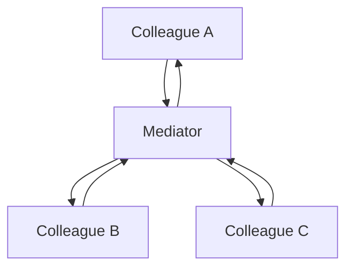

# Mediator

## Overview

Mediator defines an object that encapsulates how a set of objects interact. They stop
referencing each other directly and communicate through the mediator.

The pattern trades a web of relationships for a star — and the question that decides
whether that is good is whether the centre of the star stays understandable.

## Problem

Several objects need to coordinate with each other. Without a mediator, each knows the
others: N objects produce up to N×(N−1) possible relationships.

The classic example is a form: enabling the submit button depends on three fields, one
field depends on another's value, a selection changes a third one's options. Each
component knows several others, and adding one requires touching half of them.

With a mediator, each component knows only the mediator. The interaction rules live in
one place.

## Core Concepts

### The structure

Each colleague notifies the mediator; it decides what to do and drives the others.

### Mediator is not Observer

A frequent confusion, and the distinction is practical.

**[Observer](/03-design-patterns/observer.md)** — the subject announces and does not
know who reacts. The reactions are independent and the order does not matter.

**Mediator** — knows everyone and coordinates. The order and the dependencies between
the reactions are exactly what it encapsulates.

When order matters and there are dependencies between reactions, Observer is the wrong
structure and Mediator is the right one.

### The central risk

**The mediator accumulates.** It starts with three rules and ends with three hundred
lines of conditionals that know every colleague.

That is a trade, not a solution: the coupling left the colleagues and moved to the
centre. If the mediator becomes incomprehensible, the system got worse — before, the
coupling was distributed and locally understandable; now it is concentrated in an
object nobody can read whole.

The sign of degeneration is the mediator knowing the colleagues' internal details
rather than only their events and public operations.

### How to keep the mediator under control

Three practices.

Keep the mediator **declarative** where possible — a table of "event X triggers Y and
Z" is auditable; a chain of conditionals is not.

Split it by area of coordination when it grows — two mediators with distinct scopes
are better than one that knows everything.

Do not let business rules migrate there. The mediator coordinates; the rule belongs to
the domain.

## When to Use

- Many objects with complex interactions among them.
- The interactions have order or dependencies.
- The objects are reusable and should not know the specific context.
- The coordination logic has to change without touching the participants.

## When Not to Use

**When there are few objects.** Three components with two rules do not need a
mediator.

**When the reactions are independent.** Use [Observer](/03-design-patterns/observer.md),
which is simpler.

**When the mediator would know the colleagues' internal details.** That does not reduce
coupling — it concentrates it.

**When the coordination is genuinely a business rule.** It belongs to the domain, not
to an interface coordinator.

**When the mediator is already large.** Adding one more case to a three-hundred-line
mediator is aggravating the problem, not using the pattern.

## Alternatives

- **[Observer](/03-design-patterns/observer.md)** — independent reactions.
- **[Facade](/03-design-patterns/facade.md)** — when the goal is simplifying access,
  not coordinating interaction.
- **A state machine** — when the coordination is about transitions. See
  [State](/03-design-patterns/state.md).
- **An application service** — when the coordination is a use case, that is where it
  belongs.

## Trade-offs

| Mediator | Direct references |
|---|---|
| Colleagues decoupled from each other | A web of references |
| Interaction rules in one place | Distributed |
| Colleagues reusable | Tied to the context |
| The mediator tends to grow | Complexity distributed |
| One point of failure and of reading | No central point |

## Failure Modes

**Mediator that does everything.** The dominant mode.

**Mediator with business rules.** It stopped coordinating.

**Colleagues that still know each other.** The pattern was adopted partially and the
old coupling remains.

**Cascade through the mediator.** A colleague notifies, the mediator drives another,
which notifies back.

**Implicit order.** The rules depend on the order of the conditionals in the mediator.

## Common Mistakes

**Confusing it with Observer.**

**Letting it grow without splitting.**

**Putting business rules in the mediator.**

**Adopting it partially.** If some colleagues still reference each other, the benefit
does not materialize and the cost is paid.

## Where it appears in practice

**Complex dialogs and forms.** The original use: a screen controller that coordinates
enabling, visibility and validation across fields.

**In-process message buses.** Mediator libraries in .NET and equivalents dispatch
requests to handlers — which is Mediator as a decoupling mechanism, not a coordination
one.

**Air traffic controllers.** The classic analogy: aircraft do not coordinate among
themselves; they talk to the tower.

**Workflow orchestrators.** A coordinator that drives services in order and handles
failures — that is Mediator at system scale, and the alternative is choreography. See
[event-driven architecture](/03-design-patterns/event-driven.md).

The last brings the pattern's most important distinction at scale: **orchestration
versus choreography**. Mediator is orchestration — a centre that knows. Observer is
choreography — each part reacts to what it sees. The choice between the two reappears
in sagas and in service integration.

## Real-World Example

A health plan configuration screen had nine fields with dependencies: age band changed
the available coverages, coverage changed the amounts, dependants changed the
applicable band, and co-payment disabled three others.

The initial implementation had each field knowing the ones that depended on it. Adding
a field required touching four others, and one change produced a loop: two fields
updated each other, and the screen froze.

The mediator concentrated the rules in a declarative table: for each field, which
others to recompute when it changes. The loop became impossible because the table is
acyclic and that is verified.

Eighteen months later, the mediator had grown to 280 lines and became hard to read
again — because eligibility rules had migrated there.

The second fix extracted eligibility into the domain. The mediator went back to doing
only interface coordination, and settled at 90 lines.

The pattern worked both times. What failed in between was letting business rules
migrate into the coordinator — which is the predicted mode of degeneration.

## Related Concepts

- [Observer](/03-design-patterns/observer.md) — choreography rather than orchestration.
- [Facade](/03-design-patterns/facade.md) — simplify access, not coordinate.
- [State](/03-design-patterns/state.md) — when the coordination is about transitions.

## Practical Exercise

Draw the graph of who knows whom among the components of a screen or module in your
system.

If the number of edges approaches the square of the number of nodes, there is a web. If
a mediator already exists, count its lines and check how many are coordination and how
many are business rules.

## Interview Questions

- What is the difference between Mediator and Observer?
- What is this pattern's central risk and how do you mitigate it?
- What distinguishes orchestration from choreography?

## Further Exploration

- Gamma, Erich et al. *Design Patterns*. Addison-Wesley, 1994.
- Hohpe, Gregor; Woolf, Bobby. *Enterprise Integration Patterns*. Addison-Wesley, 2003
  — orchestration and choreography at system scale.
