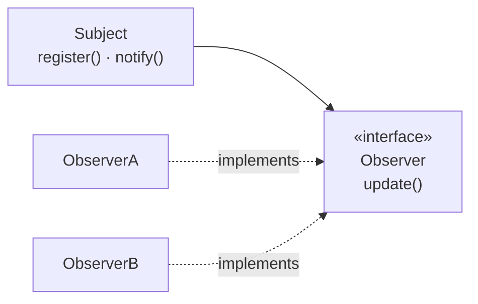

# Observer

## Overview

Observer defines a one-to-many dependency: when one object changes state, everything
depending on it is notified automatically.

It is the conceptual basis of event-driven systems, reactive interfaces and
publish-subscribe. The problems it introduces — leaks from uncancelled registration,
order dependence and cascading notifications — get little attention when the pattern is
taught, which usually stops at dependency inversion.

## Problem

Several objects need to react to changes in another, and the observed object should
not know them.

Without the pattern, whoever changes has to call each interested party explicitly —
which couples it to all of them and requires altering it for each new one.

Observer inverts that: the interested parties register, and the observed object
merely announces.

## Core Concepts

### The structure

The subject knows the interface, never the implementations.

### Push and pull models

**Push** — the notification carries the change's data. Simple, and it forces the
subject to decide what is of interest to everyone.

**Pull** — the notification says something changed; the observer queries what it
needs. More flexible, and each observer makes a query.

The choice affects coupling: push couples the subject to what the observers need;
pull couples the observers to the subject's interface.

### The problems it brings

This is the part that teaching the pattern tends to omit, and it is what matters
most.

**Memory leak.** An observer registered and never removed keeps a live reference.
The subject holds the observer, which holds whatever it references. It is the most
common cause of leaks in graphical interfaces.

**Undefined order.** Notification order is normally unspecified. If two observers
depend on each other, the behaviour varies with registration order — which is
accidental.

**Cascade.** An observer that changes the subject triggers a new notification.
Carelessly, that becomes recursion or an infinite loop.

**One failing affects the others.** If notification is synchronous and one observer
throws, the following ones may not be notified. And the subject, which does not know
them, has no way to decide what to do.

**Hard debugging.** The control flow fragments. Tracing what happens after a change
requires finding everything registered, at runtime.

## When to Use

- Several independent parties interested in a change.
- The set of interested parties varies at runtime.
- The subject should not know who reacts.
- The reactions are independent of each other and can fail in isolation.

## When Not to Use

**When there is one observer and it is fixed.** Call it directly.

**When order matters.** The pattern does not guarantee it. If there is a dependency
between reactions, they are not independent and Observer is the wrong structure —
consider an explicit sequence.

**When the reaction has to be transactional with the change.** Synchronous
notification inside a transaction couples the subject's success to the observers'.

**When the observers' lifecycle is not controlled.** If nobody guarantees
deregistration, there will be a leak.

**When the flow has to be traceable.** In critical business code, the fragmentation
of the flow costs more than the decoupling yields.

## Alternatives

- **A direct call** — when there is one fixed interested party.
- **A message queue** — when the reactions should be asynchronous, durable and
  isolated. See
  [event-driven architecture](/03-design-patterns/event-driven.md).
- **[Mediator](/03-design-patterns/mediator.md)** — when coordination among several
  objects is the problem, and order matters.
- **Reactive streams** — libraries that solve backpressure, errors and composition,
  which raw Observer does not handle.

## Trade-offs

| Observer | Direct call |
|---|---|
| The subject does not know the interested parties | Knows all of them |
| Interested parties vary at runtime | Fixed in the code |
| Fragmented flow, hard to trace | Explicit |
| Undefined order | Explicit order |
| Risk of leaks and cascades | No such risks |

## Failure Modes

**Leak from uncancelled registration.** The registered observer keeps the reference to
itself alive, and with it everything it reaches — the object leaves the screen and does
not leave memory.

**Infinite cascade.** An observer that modifies the subject.

**Accidental order becoming a dependency.** It works until someone changes the
registration order.

**Exception interrupting notification.** Later observers are not told.

**Notification during iteration.** An observer registers or deregisters during
notification, and the collection is modified while being traversed.

## Common Mistakes

**Not deregistering.**

**Assuming order.**

**Notifying inside a transaction.** It couples what should be decoupled.

**Using it for critical business flows.** Tracing becomes expensive exactly where it
is needed most.

## Where it appears in practice

**Graphical interfaces.** Event listeners on buttons and fields. It is the original
use and where leaks from uncancelled registration are most frequent.

**Reactive libraries.** RxJava, Reactor and equivalents are Observer with error
handling, composition and backpressure added — precisely the raw pattern's gaps.

**Declarative UI frameworks.** The reactivity model of modern interface libraries is
Observer under the hood, with the registration lifecycle managed by the framework — which
eliminates the leak **in the subscriptions it creates itself**. A manual subscription to
an external source, made inside a component, still requires cancelling on disposal, and
that is precisely the leak described above.

**Domain events inside a process.** An aggregate publishes; subscribers react. See
[DDD](/04-domain-driven-design/index.md).

The point the first three illustrate: the mature solutions did not abandon the
pattern — they **added what it lacks**, and what it lacks is lifecycle, errors and
order.

## Real-World Example

An order system used internal events: on confirming an order, it notified observers
that reserved stock, started billing and sent an email.

It worked until an incident. The stock observer threw due to a momentary database
outage. Notification stopped there — billing and email did not happen. The order was
left confirmed, with no reservation and no charge.

Nobody noticed for two days.

The fix had three parts. Each observer got its own error handling, and one failing
stopped interrupting the others. The reactions that must happen — stock and billing —
left Observer and became explicit, transactional steps in the use case. Only the
email, which can fail without serious consequence, remained an observer.

The lesson is not that Observer is bad. It is that it models **independent,
non-critical reactions**. Stock and billing were never either of those.

## Related Concepts

- [Mediator](/03-design-patterns/mediator.md) — coordination with order.
- [Command](/03-design-patterns/command.md) — encapsulating the reaction as an
  object.
- [Event-Driven Architecture](/03-design-patterns/event-driven.md) — the pattern at
  system scale, with durability.

## Practical Exercise

Find a point in your system that notifies observers. Answer: who deregisters, and
when? What happens if the third observer throws? Does the order matter to anyone?

## Interview Questions

- What problems does Observer introduce?
- What is the difference between push and pull?
- When is a message queue preferable to Observer?

## Further Exploration

- Gamma, Erich et al. *Design Patterns*. Addison-Wesley, 1994.
- Meijer, Erik. *Your Mouse Is a Database*. ACM Queue, 2012 — the lineage between
  Observer and reactive programming.
