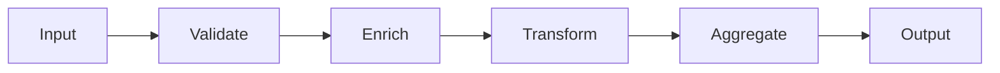

# Pipes and Filters

## Overview

Pipes and Filters decomposes processing into a sequence of independent steps — the filters
— connected by channels that carry data — the pipes.

Each filter knows neither what came before nor what comes after. That is what makes the
steps recombinable.

## Problem

Processing with several successive transformations, implemented as a single block, has
three problems.

It is not possible to test one step in isolation. It is not possible to reorder or reuse
steps in another flow. And it is not possible to parallelize or scale the step that is the
bottleneck.

The style solves all three with one restriction: **each filter has one input, one output,
and no knowledge of the context.**

## Core Concepts

### The structure

The contract between filters is the shape of the data in the pipe. As long as it is
respected, any filter can be inserted, removed or reordered.

### Stateless filters are recombinable

The property that gives the style its value: a filter with no state between invocations
can be run in parallel, retried on failure, and reused in another flow.

A stateful filter — one that accumulates, that depends on order, that keeps context
between items — loses all three properties. It is legitimate and has to be recognized as
different.

### The pipe's format is the coupling

The style does not eliminate coupling; it concentrates it in the shape of the data.

A very specific format makes the filters barely recombinable. A very generic one — a map
of keys, say — allows recombination and eliminates checking: a filter expecting a field
the previous one did not produce fails at runtime.

The trade-off between the two is the style's design decision.

### Synchrony and asynchrony

**Synchronous, in-process** — the filters are composed functions. Simple, and the whole
flow fails together.

**Asynchronous, with queues** — each filter is a consumer. It absorbs peaks, scales per
step, and brings duplication, ordering and poison messages. See
[Level 04](/06-distributed-systems/index.md).

The choice changes the nature of what is being built.

## When to Use

- The processing is naturally sequential, with distinct steps.
- The steps have to be tested in isolation.
- Steps have to be recombined into different flows.
- One step is the bottleneck and has to scale on its own.
- New steps are inserted frequently.

## When Not to Use

**When the processing is not sequential.** Flows with conditional branching, joins and
cycles feel artificial as a pipeline — and the correct model is a graph, not a line.

**When the filters need shared context.** If each step needs to know what happened in the
previous ones, the decoupling is illusory.

**When end-to-end latency matters and the pipeline is asynchronous.** Each pipe adds
latency; a seven-step pipeline over separate queues does not serve an interactive request.

**When the volume does not justify it.** Processing tens of items a day does not need a
distributed pipeline.

**When a transaction over the whole set is required.** The style processes item by item;
guaranteeing atomicity over a batch cuts across the structure.

## Alternatives

- **Composed functions** — a synchronous pipeline with no infrastructure, when there is no
  per-step scaling requirement.
- **[Chain of Responsibility](/03-design-patterns/chain-of-responsibility.md)** — when the
  semantics is "first to handle stops", not "everyone transforms".
- **A task graph** — when there is branching and joining.
- **Monolithic batch processing** — when the steps are never recombined.

## Trade-offs

| Pipes and Filters | Single block |
|---|---|
| Steps testable in isolation | Testing the whole |
| Recombinable and reorderable | Fixed |
| Scales per step | Scales as a block |
| A pipe format to maintain | No internal contract |
| Latency accumulated per step | One pass |
| Debugging crosses steps | Linear flow visible |

## Failure Modes

**Generic format with no checking.** A filter expects a missing field and fails at
runtime, far from the cause.

**Stateful filter treated as stateless.** Parallelized, it produces the wrong result.

**Absent backpressure.** A slow filter accumulates a queue indefinitely until a resource
is exhausted. See
[backpressure](/06-distributed-systems/backpressure.md).

**Poison item freezing the pipeline.** With no dead-letter queue, an item that always
fails blocks the following ones.

**Reprocessing without idempotency.** Repeating a step duplicates the effect.

## Common Mistakes

**Modelling a branching flow as a pipeline.** The pattern presupposes steps in sequence.
When the flow splits by condition and reconverges, fitting it requires pipes with detours
and filters that know the path — and what is left is no longer a pipeline, it is a badly
written state machine.

**Overly generic pipe format.** An open map between all the filters looks like flexibility
and is the opposite: no filter declares what it requires, the coupling becomes invisible,
and the only way to discover the correct order is to run it.

**Not handling backpressure in an asynchronous pipeline.** The slowest filter sets the
throughput of the whole; with no backpressure signal, the buffer before it grows until it
exhausts memory or disk. The failure appears far from the cause.

**Filters with non-idempotent side effects.** Reprocessing the pipeline is the pattern's
natural operation — after a failure, to fix a defect, to rebuild history. A filter that
charges or sends an email on every pass makes that operation impossible.

## Where it appears in practice

**Unix command-line pipes.** The origin and the purest example: `grep | sort | uniq`.
Stateless filters, a text format, recombinable by any user.

**Data pipelines.** Ingestion, cleaning, enrichment and loading. It is the dominant use
today.

**Compilers.** Lexical, syntactic and semantic analysis, optimization, generation — each
phase consumes the previous one's output.

**Media processing.** Decode, resize, watermark, encode.

Unix is instructive for a specific reason: the pipe's format is plain text, the most
generic possible. That gave universal recombination and no checking at all — the trade the
style makes, taken to the extreme, with lasting success in one domain and bad consequences
in others.

## Real-World Example

An invoice import system processed files with up to 200 thousand records. The code was a
400-line method: read, validate, enrich from the registry, compute taxes, write, notify.

Two problems. Tax computation was 80% of the time, and scaling it required scaling
everything. And testing the tax rule required a complete input file.

Decomposing into an asynchronous pipeline, with a queue between steps, solved both: the
tax filter got ten instances, the others one; and each filter got its own tests with
synthetic input.

Two problems appeared and are worth more than the gain.

The first: the enrichment filter queried the registry per record, and parallelized it
produced load that brought the registry service down. The fix was batching and adding rate
limiting.

The second: a malformed record made the validation filter throw, and the message returned
to the queue indefinitely — blocking the whole queue. A dead-letter queue and an alert
fixed it, and they should have been there from the start.

Both are predictable consequences of making the pipeline asynchronous, and both were
discovered in production.

## Related Concepts

- [Chain of Responsibility](/03-design-patterns/chain-of-responsibility.md) — a chain with
  stopping semantics.
- [Decorator](/03-design-patterns/decorator.md) — layers that wrap, not steps that
  transform.
- [Event-Driven Architecture](/03-design-patterns/event-driven.md) — when the pipes are
  queues.
- [Integration](/08-integration-architecture/index.md).

## Practical Exercise

Pick a batch process in your system and identify the sequential steps.

Measure the time of each. If one consumes most of it, it is a candidate for scaling on its
own — and that is the concrete argument for decomposing.

## Interview Questions

- What makes a filter recombinable?
- Where is the coupling in this style?
- What problems does the asynchronous version introduce?

## Further Exploration

- Hohpe, Gregor; Woolf, Bobby. *Enterprise Integration Patterns*. Addison-Wesley, 2003.
- Garlan, David; Shaw, Mary. *An Introduction to Software Architecture*, 1993.
