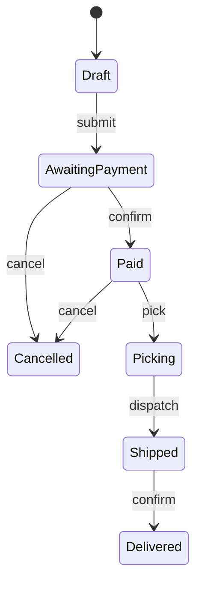

# State

## Overview

State lets an object alter its behaviour when its internal state changes, so that it
appears to change class.

Structurally it is almost identical to [Strategy](/03-design-patterns/strategy.md).
The difference that matters: **in Strategy, the client chooses; in State, the
transition happens inside, in response to events.**

## Problem

An object has states, and what it can do depends on the current one.

An order: draft, awaiting payment, paid, picking, shipped, delivered, cancelled.
Cancelling is valid in some states and not others. Invoicing requires it to be paid.

Without the pattern, that becomes state checks scattered around:

```text
cancel():
  if state == SHIPPED or state == DELIVERED:
     throw
  if state == PAID:
     refund
  state = CANCELLED
```

And the same family of checks repeats in every operation. The result is that **the
transition rules are nowhere** — they are distributed across conditionals, and nobody
can answer "which transitions are valid?" without reading the whole system.

## Core Concepts

### The structure



Each state becomes an object that implements the operations and decides the valid
transitions. The context delegates to the current state.

### The real gain is the explicit machine

The pattern's value is not polymorphism — it is that the transition rules come to
exist in an identifiable place.

That allows answering questions that previously required a full reading: which
transitions exist? Which states are terminal? How do you get from here to there?

And it allows automatic verification of part of that: walking the machine finds
unreachable states, states with no exit and duplicate transitions. What it does **not**
find is a missing transition — for that the machine has to be confronted with the
business, because the code does not know what ought to exist and is not there. It is what
the Real-World Example uncovers, by human reading.

### Who performs the transition

Two variants, with consequences.

**The state decides.** Each state knows where it can go. It distributes the knowledge
and couples the states to each other.

**The context decides.** The transition table lives in one place. Easier to audit and
visualize; the context grows.

For auditable business machines, the second is usually preferable — because the
question "which transitions are allowed?" has an answer in one file.

## When to Use

- The object has well-defined states with different behaviour in each.
- The transitions have rules that matter to the business.
- State checks repeat across several operations.
- New states appear frequently.
- The lifecycle has to be audited or visualized.

## When Not to Use

**When there are two states.** A boolean and an `if` solve it.

**When the behaviour does not change with the state.** If the state is just a label,
there is no polymorphism to exploit — it is a field.

**When the transitions are trivial and linear.** A flow with no branching and no rules
does not need a machine.

**When the complexity is in the data, not the behaviour.** If every state has the same
methods with different validations, a rules table may be clearer than a hierarchy.

**When a state machine library solves it better.** For large machines, a declaration
in data with verification and visualization beats a manual implementation in classes.

## Alternatives

- **An enum with behaviour** — in languages that allow it, the enum carries the
  transition and is more compact.
- **A transition table** — a map from (state, event) to state, verifiable and
  visualizable.
- **A state machine library** — for large machines or ones with persistence.
- **A conditional** — for two or three stable states.

## Trade-offs

| State | Scattered conditional |
|---|---|
| Transitions in an identifiable place | Distributed |
| A new state does not touch the existing ones | Touches every check |
| Auditable and visualizable | Has to be reconstructed by reading |
| One class per state | No extra classes |
| Indirection when reading | Direct flow |

## Failure Modes

**States that know each other too well.** In the variant where the state decides, the
web of references between them becomes as coupled as the conditional it replaced.

**Unreachable state.** It exists in the hierarchy and no transition leads to it.

**Missing transition.** A combination valid in the business does not exist in the
code, and is discovered in production.

**Persisted state diverging from the code.** The database holds values the current
machine does not know — the most expensive failure mode, because it shows up in old
data.

**State explosion.** Combinations of two dimensions modelled as distinct states.

## Common Mistakes

**Confusing it with Strategy.** The internal transition is the distinction.

**Applying it with two states.**

**Not handling legacy persisted states.** Every change to the machine has to consider
what is already stored.

**Modelling two dimensions as one set of states.** It produces combinatorial
explosion; use two fields.

## Where it appears in practice

**Lexers and protocol parsers.** State is intrinsic to the problem.

**Order, subscription and claim flows.** The most common use in business systems, and
where the machine's auditability has regulatory value.

**Network connections.** Open, connecting, connected, closing, closed — with
transitions the protocol defines.

**User interfaces with step-based flows.** Each step enables different actions.

In the business cases, the dominant reason for adopting the pattern is not code
organization — it is that someone has to **answer in writing** which transitions are
possible, and that answer needs to be in one place.

## Real-World Example

An insurance claims system had nine states and checks scattered across twelve
services.

The problem that forced the change was one of auditing, not technical: the regulator
asked for documentation of the possible transitions, and the team took three weeks to
reconstruct it by reading the code — and the reconstructed version had errors.

Extracting into an explicit state machine, with the transition table in one file, made
the answer immediate. A test came to generate the diagram from the table.

Two findings appeared during the extraction. One transition existed in the code and
should not — a denied claim could go back to "under review" through a path nobody knew
about. And two transitions the business expected did not exist.

The pattern did not fix those things. It made them visible, which is what the scattered
conditional prevented.

## Related Concepts

- [Strategy](/03-design-patterns/strategy.md) — same structure, external choice.
- [Command](/03-design-patterns/command.md) — encapsulating the transition as an
  object.
- [Memento](/03-design-patterns/memento.md) — capturing and restoring state.

## Practical Exercise

Pick an entity in your system that has a status field.

List all possible values and, for each pair, check whether the transition is allowed.
Then find in the code where each check happens.

The number of places and the difficulty of assembling the table say whether the pattern
pays off.

## Interview Questions

- What is the difference between State and Strategy?
- What is the real gain of an explicit state machine?
- What do you do about already-persisted states when changing the machine?

## Further Exploration

- Gamma, Erich et al. *Design Patterns*. Addison-Wesley, 1994.
- Harel, David. *Statecharts: A Visual Formalism for Complex Systems*, 1987.
