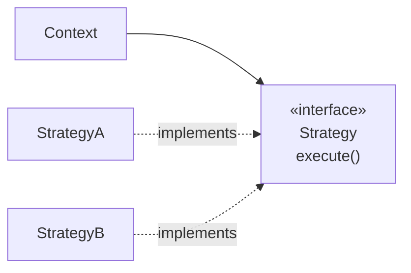

# Strategy

## Overview

Strategy defines a family of algorithms, encapsulates each one, and makes them
interchangeable.

It is the pattern that turns up in more places in application code than any other, almost
always in the degenerate form of a function passed as an argument. And it is where the
ceremony of the full version — interface, implementations, selection — most often charges
without delivering: with two variants nobody is going to extend, an `if` says the same
thing in fewer lines.

## Problem

An operation has several ways of being carried out, and the choice depends on
context.

Without the pattern, that becomes a conditional that grows:

```text
if type == A:   algorithm A
else if B:      algorithm B
else if C:      algorithm C
```

Three problems appear when that conditional grows.

It replicates: other operations need the same distinction, and the `switch` appears
in several places. Adding a case touches all of them.

It mixes levels: the selection logic and the implementations live together, and the
method gets long.

And it prevents variation at runtime: the choice is in the code, not in the data.

## Core Concepts

### The structure

Only the context's arrow is solid — the other two mark implementation, not use.



The context holds a strategy and delegates. Swapping the strategy swaps the
behaviour without touching the context.

### Strategy is composition over inheritance applied

What [Template Method](/03-design-patterns/template-method.md) does with inheritance,
Strategy does with composition — and so it inherits the advantages: variation at
runtime, no coupling to the base's implementation, and multiple combinable axes.

### In languages with first-class functions, it is a function

When the strategy has a single method, the interface is ceremony. Passing a function
solves the same thing with less code:

```text
calculate(amount, rate -> amount * rate)
```

That is not a minor simplification — it is the form the pattern takes in most modern
code, and the reason "Strategy" appears less often as an explicit name even while
being used constantly.

### Where the selection lives

The pattern does not say who chooses the strategy. Three options, with different
consequences: the client chooses and injects; a factory chooses from a piece of
data; or configuration defines it.

The second merely moves the `switch` into the factory — which is a real improvement
(it exists once, not in every operation), but does not eliminate it.

## When to Use

- There are real variants of an algorithm, with more than one implementation in use.
- The choice has to happen at runtime or by configuration.
- The conditional replicates in more than one place.
- New variants appear frequently.
- Each variant needs to be tested in isolation.

## When Not to Use

**When there are two stable variants.** An `if` is more readable than an interface
and two classes. The pattern pays off from three onwards, and mainly when the number
grows.

**When the variants never change.** With no future variation, the flexibility is
never exercised.

**When the conditional appears only once.** There is no replication to eliminate.

**When the language offers first-class functions and the strategy has one method.**
Use the function.

**When the strategies need different data.** If each requires distinct parameters,
the common interface becomes a set of optional parameters — and the pattern is
forcing a uniformity that does not exist.

## Alternatives

- **A function as a parameter** — the modern form of the same pattern.
- **A simple conditional** — for two stable variants.
- **A dispatch table** — a map from key to function, when the selection is by value.
- **Polymorphism on the object itself** — if the variation follows the data's type,
  the method can live there.

## Trade-offs

| Strategy | Conditional |
|---|---|
| A new variant does not touch the existing ones | Touches the conditional |
| Each variant testable in isolation | Tests go through the conditional |
| Choice at runtime | Fixed in the code |
| More types and more files | Everything in one place |
| Indirect flow | Readable linearly |
| The selection still has to live somewhere | The selection is the conditional itself |

## Failure Modes

**Interface with optional parameters.** A sign that the strategies are not uniform.

**Stateful strategy.** If it keeps state between calls, sharing it between contexts
produces a defect.

**Explosion of trivial classes.** Twenty one-line strategies.

**Scattered selection.** The `switch` you wanted to eliminate reappears in the
several places that choose the strategy.

## Common Mistakes

**Applying it with two variants.** Three files to replace a two-line `if`, and the third
variant that would justify the structure never arrives.

**Creating an interface where a function suffices.**

**Thinking it eliminates the conditional.** It is moved into the selection; the gain
is that it exists once.

**Confusing it with [State](/03-design-patterns/state.md).** Strategy is chosen from
outside; State changes on its own as the object evolves.

## Where it appears in practice

**Sort comparators.** `sort(list, comparator)` is Strategy: the comparison algorithm
is passed in. In modern languages, a function.

**Encoding and compression.** Libraries that accept the algorithm as a parameter.

**Retry policies.** Fixed wait, exponential, with jitter — each a strategy, chosen by
configuration.

**Shipping, tax and discount calculation.** The most common use in business systems,
and the one that usually justifies the pattern: the variants are many, they change by
external decision, and they need to be tested in isolation.

In the first three, the predominant form today is the function. In the fourth, the
interface is justified because each strategy usually needs more than one operation
and dependencies of its own.

## Real-World Example

A subscription system calculated discounts with a 200-line method and seven branches:
first month, annual, coupon, referral, partnership, employee, reactivation.

The conditional existed in three places: value calculation, simulation display and
the financial report. All three had diverged — the report did not know about
"reactivation", added six months earlier.

Extracting into strategies resolved the divergence by construction: one place per
discount type came to exist, and the three consumers use the same objects.

What the team got wrong at first and fixed later: it also created `NoDiscountStrategy`
to "eliminate the null". It never did anything and added a case to every reading of
the code. It was removed, and the absence of a discount went back to being represented
by the absence of a strategy.

Not every case needs a class.

## Related Concepts

- [State](/03-design-patterns/state.md) — similar, with internal transitions.
- [Template Method](/03-design-patterns/template-method.md) — the inheritance
  version.
- [Bridge](/03-design-patterns/bridge.md) — two dimensions, not one.
- [Composition vs. Inheritance](/02-software-design/composition-vs-inheritance.md).

## Practical Exercise

Find the longest `switch` or `if` chain in your system.

Check: does it appear in more than one place? Have the copies diverged? How many
branches were added in the last year?

The three answers together say whether Strategy pays off there.

## Interview Questions

- What is the difference between Strategy and State?
- Does Strategy eliminate the conditional?
- When is a function preferable to an interface?

## Further Exploration

- Gamma, Erich et al. *Design Patterns*. Addison-Wesley, 1994.
