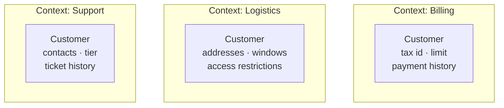

# Bounded Context

## Overview

A bounded context is the boundary within which a model and its language have a single,
consistent meaning.

It is DDD's most consequential concept, because it is the only one that decides
architecture directly: context boundaries are the best candidates for module boundaries
and, later, service boundaries.

## Problem

The natural ambition when modelling a company is a single model: one definition of
"customer", one of "product", one of "order", shared by every system.

That is appealing and impossible.

"Customer" in billing is a tax entity with a registration number, payment terms and a
delinquency history. In logistics, it is a set of addresses with delivery restrictions and
receiving windows. In support, it is a person with an interaction history and a contract
tier.

Forcing a common model produces one of two results, and both are bad.

**The bloated model** — a `Customer` class with sixty fields, of which each context uses
eight, and nobody knows which are mandatory in which situation.

**The minimal model** — only what the three have in common, which leaves each context
implementing the rest outside, with duplication and divergence.

Bounded context accepts what reality imposes: **different models, with explicit boundaries
and translation between them.**

## Core Concepts

### The same word, different meanings

The most reliable sign that there is a boundary: a term changes meaning.

All three refer to the same real-world entity. They are three models, and they should
remain three.

What links them is a shared identifier, not a shared class.

### A context is a solution; a subdomain is a problem

See [subdomain](/04-domain-driven-design/subdomain.md). The ideal is one context per
subdomain, and reality diverges:

One subdomain served by two contexts — frequently for historical reasons.

One context covering three subdomains — the typical legacy system case.

When they diverge, that is information about where the software does not keep up with the
business.

### The context defines the model's limit

Inside the boundary, the model is consistent and the language is single. Outside, nothing
is guaranteed.

That means the boundary has to be real — enforced by a module, a process, or a system. A
boundary that only exists in the diagram delimits nothing, and the model leaks. See
[architecture vs. implementation](/01-fundamentals/architecture-vs-implementation.md).

### Contexts communicate through translation

No context exposes its internal model. Communication happens through contracts belonging
to the boundary, with translation on both sides.

The forms of relationship between contexts — partnership, customer-supplier, conformist,
and others — are the subject of
[context mapping](/04-domain-driven-design/context-mapping.md). The defence against
another's model is the
[anti-corruption layer](/04-domain-driven-design/anti-corruption-layer.md).

## Mental Model

**Where the vocabulary changes meaning, there is a boundary.**

It is a test you apply by listening to people work. When two areas use the same word and
have to clarify what they mean, the boundary is there.

## When to Use

- Different areas of the business use the same terms with distinct meanings.
- Different teams work on different parts of the domain.
- A single model is becoming bloated or full of conditional cases.
- Parts of the system evolve at different rates.
- You need to integrate with an external system that has its own model.

## When Not to Use

**When there is one model and it serves well.** In a small system, with one team and a
cohesive domain, creating boundaries adds translation without solving anything.

**When the proposed boundaries do not correspond to a change of meaning.** Contexts created
by organizational symmetry or by technical layer capture nothing.

**Before understanding the domain.** A wrong context boundary is expensive: it dictates
where translation happens and, later, where services are extracted. Start with weak
internal boundaries.

**When the translation cost exceeds that of a shared model.** Two contexts with ninety per
cent overlap and constant translation were probably one.

## Alternatives

- **A shared model (*shared kernel*)** — two contexts deliberately share a small part of
  the model. It reduces translation and couples the two teams; it requires an explicit
  agreement about changes.
- **A single context** — legitimate in small systems.
- **A context per external system** — each integration gets its own, with translation at
  the boundary.

## Trade-offs

| Separate contexts | Unified model |
|---|---|
| Each model serves its problem well | Serves all badly |
| Teams evolve independently | Coordination on every change |
| Precise vocabulary in each area | Ambiguous terms |
| Translation at every boundary | No translation |
| Data duplicated across contexts | One source |
| Eventual consistency between them | Transactional |

The fifth row is what generates the most resistance: duplicating customer data across three
contexts feels wrong. It is the price of each context having the model it needs, and it is
usually smaller than the cost of the bloated model.

## Failure Modes

**A context that leaks its model.** It exposes its entities; the neighbours come to depend
on the internal structure.

**Nominal boundary.** It exists in the diagram and nothing enforces it.

**Corporate canonical model.** The attempt to define "the company's customer" consumes
years and does not converge — because the premise is wrong.

**Too many contexts.** Boundaries where there is no change of meaning produce constant
translation.

**Shared database between contexts.** It nullifies the boundary: both come to depend on the
same schema.

## Common Mistakes

**Seeking a single model for the company.** The mistake the concept exists to correct.

**Confusing it with a subdomain.** Solution versus problem.

**Drawing boundaries by organizational structure without checking the vocabulary.** The
organization is a clue, not the answer.

**Not enforcing the boundary.**

**Sharing entities between contexts "so as not to duplicate".** It is the path back to the
unified model.

## Real-World Example

A pharmacy chain had a system with a `Product` entity of 84 fields.

Analysing the usage showed three groupings of fields that were never used together:

**Commercial** used price, margin, supplier, purchase terms, ABC classification.
**Regulatory** used active ingredient, controlled-substance class, agency registration,
prescription requirement, special control.
**Logistics** used dimensions, weight, storage conditions, expiry, batch.

None of the three used more than 30 of the 84 fields. And there were 19 fields that only
made sense for some kinds of product, producing conditional validations scattered around.

Splitting into three contexts, linked by the product code, solved three problems at once.

The conditional validations disappeared: in the regulatory context, `Medicine` has a
mandatory controlled-substance class, and `HygieneProduct` is a different thing. In the
commercial one, that distinction does not exist.

The regulatory team came to change its rules without coordinating with commercial.

And product registration stopped requiring 84 fields: each context asks for what it needs,
when it needs it.

What generated the most resistance was duplicating the product name across the three
contexts. It took time to accept that the commercial name, the regulatory name and the
packaging description were in fact three things — and that the old system forced them to be
one, with a field nobody could say which of the three it meant.

## Related Concepts

- [Ubiquitous Language](/04-domain-driven-design/ubiquitous-language.md) — the language
  inside the boundary.
- [Context Mapping](/04-domain-driven-design/context-mapping.md) — how the contexts relate.
- [Anti-Corruption Layer](/04-domain-driven-design/anti-corruption-layer.md) — the defence
  at the boundary.
- [Modular Design](/02-software-design/modular-design.md) — the boundary in code.

## Practical Exercise

Pick three central terms in your domain. For each, ask people from different areas what it
means.

Where the answers diverge — even subtly — there is a context boundary the model probably
does not represent.

## Interview Questions

- What is the difference between a bounded context and a subdomain?
- Why does the corporate canonical model usually fail?
- What links two contexts that refer to the same real-world entity?

## Further Exploration

- Evans, Eric. *Domain-Driven Design*. Addison-Wesley, 2003.
- Vernon, Vaughn. *Implementing Domain-Driven Design*. Addison-Wesley, 2013.
- Fowler, Martin. *BoundedContext*, 2014.
