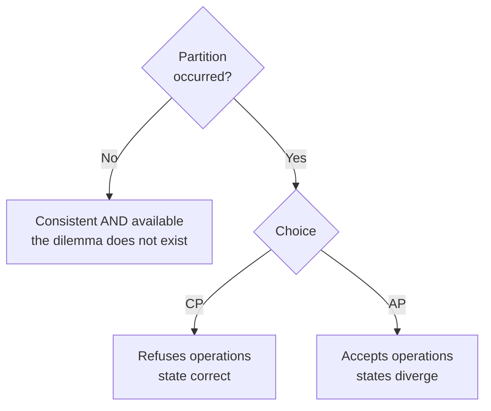

# CAP

## Overview

The CAP theorem, formulated by Eric Brewer and proved by Gilbert and Lynch, asserts:

> A distributed system cannot simultaneously guarantee **consistency** and
> **availability** when a **network partition** occurs.

The popular reading — "pick two of the three" — is wrong, and the error has a practical
consequence: it suggests a permanent architectural decision, when the theorem describes the
behavior during a rare event.

## The Problem

CAP is the most cited and most misquoted theoretical result in the field.

Three common misconceptions:

**"Pick two of three."** A partition is not a choice — it is something that happens to you. You do
not decide "not to have partitions"; you decide what to do when one occurs.

**"We are AP" or "we are CP" as the system's identity.** The choice is per operation, not per
system. The same database can respond in different ways depending on the operation's
configuration.

**"CAP explains why we gave up consistency."** Outside a partition, there is no CAP dilemma. The
system can be consistent **and** available. If it is not, the reason is another one — typically
latency, which is what [PACELC](/06-distributed-systems/pacelc.md) deals with.

## Core Concepts

### What each letter means here

**C — Consistency.** Specifically **linearizability**: every read observes the most recent write.
It is a narrower definition than the "C" in ACID.

**A — Availability.** Every request to a non-failing node receives a response. An error response
does not count as available.

**P — Partition tolerance.** The system keeps operating despite messages lost between nodes.

### The correct formulation

**During a partition**, a distributed system chooses between:

**CP** — refusing operations that cannot guarantee consistency. The system becomes unavailable for
some clients, and the state remains correct.

**AP** — continuing to accept operations. The system stays available, and the states diverge —
which requires
[conflict resolution](/06-distributed-systems/conflict-resolution.md) afterwards.

Note that the left branch is where the system spends 99.99% of its time — and CAP says nothing
about it.

### The choice is per operation

A commerce system can reasonably decide:

| Operation | Under a partition |
|---|---|
| View the catalog | AP — serve possibly stale data |
| Add to cart | AP — reconcile later |
| Check out with unique stock | CP — refuse |
| Look up a previous order | AP |

Treating that as a system decision forces the most critical operation to define the behavior of
all of them.

### Partitions are rare; so is the dilemma

Partitions happen — and they are rare relative to operating time. A system can go months without
one.

That means **CAP is not the dominant day-to-day trade-off**. The dominant one is latency versus
consistency, which holds always. See [PACELC](/06-distributed-systems/pacelc.md).

Teams that decide the whole architecture based on CAP are optimizing for the rare case and
ignoring the permanent one.

## Why This Matters

**Because the decision under a partition has to be deliberate.** If nobody decided, the behavior is
whatever the database's default configuration does — and frequently it is not what the business
would accept.

**Because the choice belongs to the business.** "Under a partition, do we prefer to refuse sales or
accept the risk of a double sale?" is a business question, and the answer varies by domain.

**Because the wrong quotation leads to the wrong decision.** Concluding "we are AP, therefore we
give up consistency always" trades a permanent guarantee for a rare event.

## Common Mistakes

**"Pick two of three".** A partition is not optional in a distributed system.

**Treating it as a property of the system.** It is per operation.

**Using CAP to justify eventual consistency outside a partition.** There the correct argument is
latency.

**Confusing CAP's C with ACID's C.** They are different things: one is linearizability, the other
is invariant preservation.

**Thinking single-node systems have a CAP dilemma.** With no distribution, there is no partition.

**Not configuring the behavior under a partition.** The default decides for you.

## Real-World Example

A pharmacy chain had its sales system replicated between headquarters and each store, so that
stores would keep selling if the connection dropped.

The connection dropped frequently — store internet, in small towns.

The original configuration was AP for everything: the store kept operating with the local replica
and synchronized on reconnection.

It worked for most operations and produced two serious problems.

**Controlled medications.** The sale requires registration in a national system with verification
that the prescription has not already been used. Two stores sold against the same prescription
during a 40-minute partition. That is a regulatory violation with consequences for the operating
license.

**Scarce item stock.** During campaigns, items with few units were sold beyond availability,
generating cancellations and complaints.

The review separated the operations.

**CP** — sale of controlled medications and reservation of an item with stock below a threshold.
With no connection to headquarters, the operation is refused with an explicit message to the
clerk. A lost sale is preferable to a regulatory violation.

**AP** — sale of a common item, price lookup, customer registration, loyalty program. Everything
keeps working with the local replica and reconciles later.

What made the decision possible was bringing the pharmacist in charge into the conversation. The
question — "under a partition, do we prefer to refuse the sale or accept the risk of duplicating a
prescription?" — is not technical, and her answer was immediate and unequivocal.

## Related Concepts

- [PACELC](/06-distributed-systems/pacelc.md) — the extension that covers the common case.
- [Consistency](/06-distributed-systems/consistency.md) — the spectrum of guarantees.
- [Availability](/06-distributed-systems/availability.md).
- [Network Failure](/06-distributed-systems/network-failure.md) — where the partition comes from.

## Practical Exercise

For the three most critical operations in your system, answer: if the network between the
application and the database is partitioned, what should happen — refuse, or accept and reconcile?

Then check what the system does today. If nobody decided, the configuration's default decided.

## Interview Questions

- State CAP correctly. Why is "pick two of three" imprecise?
- Why does CAP not describe the system's normal behavior?
- Is the choice between CP and AP the system's or the operation's?

## Further Reading

- Gilbert, Seth; Lynch, Nancy. *Brewer's Conjecture and the Feasibility of Consistent, Available,
  Partition-Tolerant Web Services*. SIGACT News, 2002.
- Brewer, Eric. *CAP Twelve Years Later: How the "Rules" Have Changed*. IEEE Computer, 2012 — the
  author himself correcting the misreadings.
- Kleppmann, Martin. *A Critique of the CAP Theorem*, 2015.
