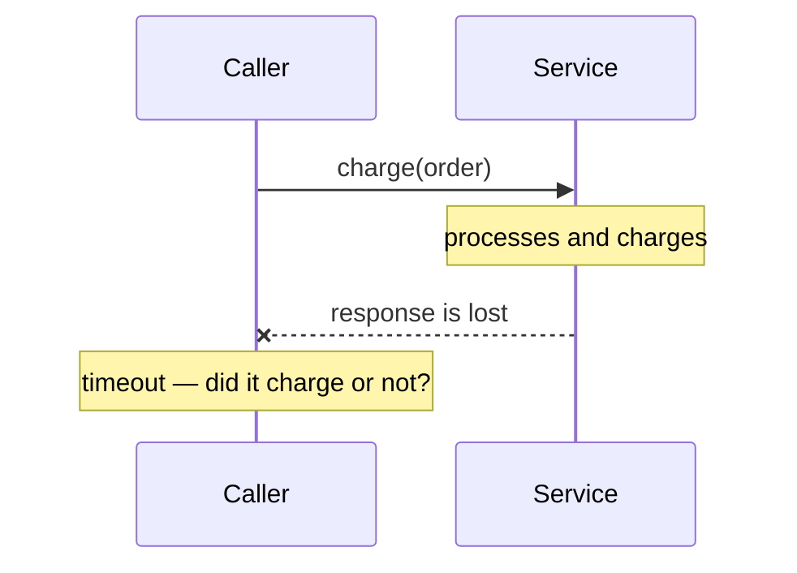

# Distributed Systems Fundamentals

## Overview

A system is distributed when components on different machines coordinate over the network.

The definition is banal. The consequence is not: **crossing the network changes the nature of
the call**, and practically every difficulty in the following levels derives from that.

## The Problem

In a function call, three things are true and nobody has to think about them. The call
happens or does not happen. If the process dies, it dies whole. And the time between calling
and receiving is negligible.

In a network call, all three stop holding.

The call has **three outcomes**, not two: success, failure, and *I don't know*. The third is
what makes everything hard — when the timeout fires, you do not know whether the operation
happened.

The process on the other side can die without yours dying. That is
[partial failure](/06-distributed-systems/partial-failure.md), and it is the structural
difference.

And time stops being negligible: it varies, and the variation is larger than the average.

The temptation is to treat the remote call as a slower local call. It is not. It is an
operation with different semantics, and designing as if it were not produces systems that
work in testing and fail in production in ways nobody can reproduce.

## Core Concepts

### The eight fallacies

Peter Deutsch and colleagues named the premises everyone assumes without noticing:

| Fallacy | What actually happens |
|---|---|
| The network is reliable | Packets are lost, connections drop |
| Latency is zero | It varies from microseconds to hundreds of milliseconds |
| Bandwidth is infinite | It is finite and shared |
| The network is secure | Traffic is interceptable and forgeable |
| Topology does not change | Instances come and go all the time |
| There is one administrator | There are several, with different policies |
| Transport cost is zero | Serialization and bandwidth cost |
| The network is homogeneous | Protocols, versions and capabilities differ |

The list is nearly three decades old and still describes the defects that appear in new
systems. It works as a diagnosis: faced with inexplicable behavior, one of those premises was
frequently assumed.

### The third outcome

The timeout's ambiguity is the most consequential concept at this level.

From the caller's side, "the response did not arrive" is indistinguishable from "the request
did not arrive". Retrying may duplicate; not retrying may lose.

The only way out is to make the operation repeatable with no additional effect — which is
[idempotency](/06-distributed-systems/idempotency.md), and it is why it is the central concept
of this section, not a detail.

### There is no global time

Clocks on different machines diverge. That means "happened before" is not decidable by
comparing timestamps from distinct machines.

The practical consequence appears in ordering, in credential expiry and in conflict
resolution. See [clocks and time](/06-distributed-systems/clock-and-time.md).

### There is no perfect knowledge

A node cannot distinguish with certainty between "the other one went down" and "the other one
is slow". That impossibility is what makes
[failure detection](/06-distributed-systems/failure-detection.md) a problem of heuristics, not
of truth — and what underlies the limits of
[CAP](/06-distributed-systems/cap.md) and [consensus](/06-distributed-systems/consensus.md).

### The recommendation that precedes everything

**Do not distribute without need.** Every network boundary adds partial failure, latency,
ordering and duplication to your system.

A well-modularized monolith has none of those problems. See
[modular monolith](/03-design-patterns/modular-monolith.md).

## Why This Matters

**Because the wrong premises produce irreproducible defects.** A system designed as if the
network were reliable works 99% of the time and fails in ways that only appear under load, and
that no local test reproduces.

**Because the cost is taken on from day one.** By distributing, you permanently acquire the
problems of this section. Recognizing them beforehand is what lets you decide whether it is
worth it.

**Because idempotency has to come in early.** It is cheap to design and expensive to retrofit
— it requires changing the data model.

## Common Mistakes

**Treating a remote call as a slower local one.** See
[Proxy](/03-design-patterns/proxy.md): the transparency invites the error.

**Assuming a timeout means it did not happen.**

**Comparing timestamps from different machines.**

**Retrying with no idempotency.**

**Distributing by reputation.** The cost is permanent.

**Testing only the happy path.** The defects at this level live in the failure paths, and they
have to be exercised deliberately.

## Real-World Example

A billing integration had worked for two years. On a Tuesday, 340 customers were charged
twice.

The cause: the payment provider had a latency spike. Responses started taking longer than the
configured 10-second timeout. The HTTP client retried automatically after a timeout — the
library's default behavior, which nobody had reviewed.

Each retry created a new charge, because the endpoint was not idempotent.

Three wrong premises at the same time. That latency is stable — it varied by an order of
magnitude. That a timeout means it did not happen — it meant it was unknown. And that retrying
is safe — it only is if the operation is idempotent.

The fix had three parts, and the order matters.

Automatic retries were disabled for non-idempotent operations — an immediate measure, applied
the same day.

The endpoint got an idempotency key: the client sends a unique identifier per charge attempt,
and the provider returns the original result if the key has already been seen.

And the timeout was recalibrated from the measured 99th percentile, not from the round number
somebody chose.

The detail the team highlights: none of that was new knowledge. All three fixes are in the
provider's documentation. What was missing was treating the integration as distributed, and
not as a function call that sometimes takes a while.

## Related Concepts

- [Partial Failure](/06-distributed-systems/partial-failure.md) — the structural difference.
- [Idempotency](/06-distributed-systems/idempotency.md) — the answer to the third outcome.
- [Timeouts](/06-distributed-systems/timeouts.md) and
  [Retries](/06-distributed-systems/retries.md) — what to do with the ambiguity.
- [Modular Monolith](/03-design-patterns/modular-monolith.md) — the alternative to
  distributing.

## Practical Exercise

Pick an external integration in your system and answer: what happens if the timeout fires? Are
there automatic retries? Is the operation idempotent?

If there are retries with no idempotency, you have the same incident from the example waiting
for a latency spike.

## Interview Questions

- Why is a remote call not a slower local call?
- What are the three outcomes of a network call?
- Name three fallacies of distributed computing and the defect each one produces.

## Further Reading

- Deutsch, Peter; Gosling, James. *The Fallacies of Distributed Computing*, 1994–1997.
- Kleppmann, Martin. *Designing Data-Intensive Applications*. O'Reilly, 2017 — chapter 8, on
  the problems of distributed systems.
- Waldo, Jim et al. *A Note on Distributed Computing*, 1994 — the classic argument against
  remote transparency.
