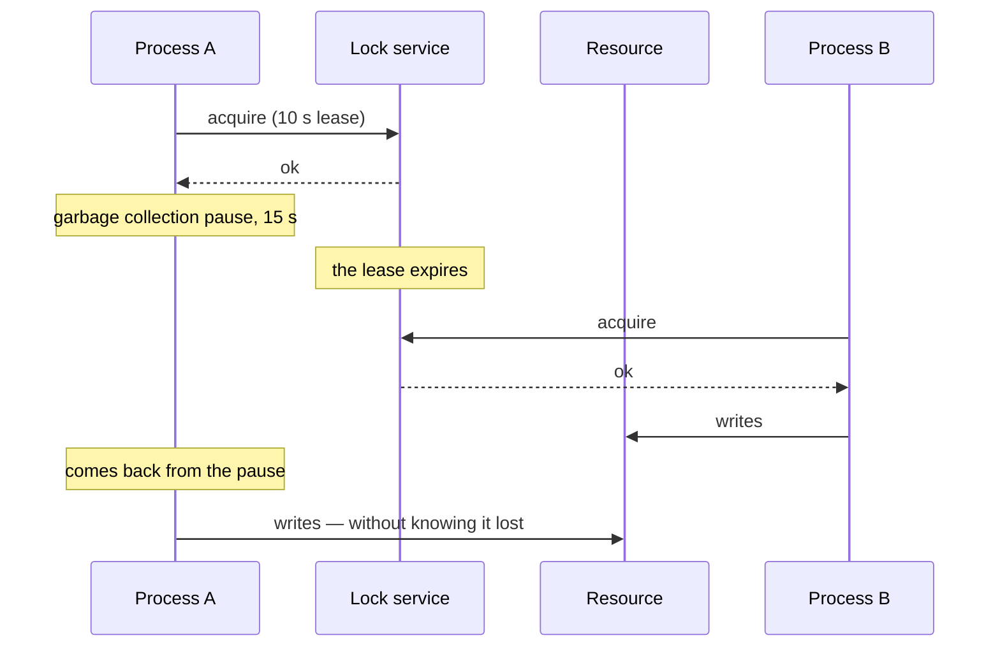

# Distributed Locks

## Overview

A distributed lock coordinates exclusive access to a resource among processes on different machines.

This document's central claim, and the one that surprises most: **a distributed lock with a deadline
does not guarantee mutual exclusion.** It reduces the probability of concurrency; it does not
eliminate it.

## Problem

A local lock works because the operating system guarantees only one thread holds it, and because the
thread holding it is alive by definition — if it dies, the process dies and the lock is released.

Distributed, neither of those holds.

The holder can become unreachable without dying. If the lock does not expire, it stays held
indefinitely. If it expires, another process acquires it — and the first one **can keep operating**,
without knowing it lost.



Both writes happen. The lock worked as specified and mutual exclusion was not obtained.

## Core Concepts

### A deadline is mandatory and insufficient

With no deadline, a holder that dies locks the resource forever. With a deadline, the window above
exists.

There is no deadline value that eliminates the problem — only values that make the window more or
less likely. Garbage collection pauses, virtual machine suspension, disk slowness and network
partitions produce delays no reasonable deadline covers.

### Fencing is what actually protects

The correct solution is not in the lock: it is in the **resource**.

Each acquisition receives an increasing number. The protected resource records the highest number it
has seen and **rejects operations with a lower number**.

```text
A acquires → token 33 → pause
B acquires → token 34 → writes, the resource records 34
A returns  → writes with token 33 → the resource rejects it
```

That works even when A does not know it lost, because the check does not depend on A.

The requirement is that the resource participates — that it knows how to compare tokens. Storage
that accepts any write cannot be protected that way, and then the lock is only a probabilistic
optimization.

### A lock for performance versus for correctness

The distinction that decides how much rigor is necessary:

**For efficiency.** Avoiding duplicated work. If two processes execute, the result is waste — not
incorrectness. Here a simple lock with a deadline suffices, and fencing is unnecessary.

**For correctness.** Two executions produce an invalid state. Here a lock with a deadline **is not
sufficient**, and fencing or another guarantee is needed.

Most real uses are for efficiency, and treating them with correctness-level rigor is waste. The
expensive error is the inverse: using a simple lock where correctness depends on it.

### Frequently the lock is avoidable

Before coordinating, three questions:

**Can the operation be idempotent?** If executing twice is harmless, there is nothing to coordinate.
See [idempotency](/06-distributed-systems/idempotency.md).

**Can the resource enforce the exclusion?** A uniqueness constraint in the database, or a conditional
update, guarantees correctness with no external lock — and the database already handles concurrency
very well.

**Can the operation be partitioned?** If each process handles a disjoint subset, there is no
concurrency.

The third is the most elegant and the least considered.

### Where the lock lives matters

A lock in a system with no consensus — a single-node distributed cache, for example — can be lost
during a node failure, allowing two holders.

A lock in a system with consensus is reliable regarding acquisition, and it remains subject to the
deadline problem.

## Mental Model

**The lock says who should be operating. Fencing guarantees who can.**

## When to Use

- Coordination for efficiency, avoiding duplicated work.
- The resource offers no exclusion mechanism of its own.
- The operation is one-off, not a continuous leadership — for that, see
  [leader election](/06-distributed-systems/leader-election.md).

## When Not to Use

**For correctness, with no fencing.** It is the central error.

**When the database can enforce it.** A uniqueness constraint or a conditional update is simpler and
more reliable.

**When idempotency solves it.**

**When the operation can be partitioned.**

**With a long deadline.** If the holder dies, the resource stays locked for the whole period.

**As a substitute for a transaction.** If the operations fit in one database, the transaction gives
better guarantees.

## Alternatives

- **Uniqueness constraint** — the database enforces it.
- **Conditional update** — "update if the version is X", which is optimistic locking.
- **Idempotency** — allowing multiple execution.
- **Partitioning** — eliminating the concurrency.
- **[Leader election](/06-distributed-systems/leader-election.md)** — for continuous coordination
  instead of one-off.

## Trade-offs

| With a lock | Without |
|---|---|
| Duplicated work avoided | Possible |
| Explicit coordination | None |
| An additional point of failure | No dependency |
| Acquisition latency | None |
| A false sense of exclusion with no fencing | No illusion |

## Failure Modes

**A paused holder.** The case in the diagram.

**A deadline expiring during a long operation.** The operation continues with no lock.

**A lock not released.** A failure before releasing; the resource is locked until the deadline.

**The lock service unavailable.** Nobody acquires; or worse, the system decides to proceed with no
coordination.

**Divergent clocks.** The deadline is interpreted differently.

## Common Mistakes

**Using it for correctness with no fencing.**

**Not renewing the deadline during a long operation.** Or renewing without checking that you still
hold the lock.

**A badly sized deadline.** Too short expires midway; too long locks things up.

**Not considering the alternatives.** Most cases do not need a lock.

**Assuming the lock service is always reliable.**

## Real-World Example

An import system used a distributed lock to guarantee that only one process imported each file.

The lock was a record in a distributed cache with a 60-second deadline, renewed every 30.

A large file took 4 minutes. During the processing, there was a 70-second garbage collection pause on
the instance. The deadline expired and the renewal did not happen.

Another instance acquired the lock and started importing the same file.

The first came back from the pause, renewed the lock — the service accepted it, because the renewal
did not check whether it was still the holder — and continued.

Two instances imported the same file. 12 thousand duplicated records.

Three fixes, and the order reveals the reasoning.

**The first attempt** was to increase the deadline to 5 minutes. That reduced the probability and did
not eliminate the problem — it merely required a longer pause.

**The second** was fixing the renewal: checking ownership before renewing, with an atomic operation.
That prevented the specific case and does not prevent the instance from continuing to write after
losing the lock.

**The third** is what solved it, and it did not involve the lock: **idempotency in the import**. Each
record came to have a key derived from the file and the line, with a uniqueness constraint in the
database. Importing twice comes to insert once.

The lock stayed, now explicitly as an efficiency optimization — avoiding duplicated work — and not as
a correctness guarantee.

In retrospect: they spent two weeks tuning deadlines for a problem that had no deadline-based
solution. The right question — "what happens if it imports twice?" — came later, and the answer took
three days.

## Related Concepts

- [Leader Election](/06-distributed-systems/leader-election.md) — the same problem, with fencing.
- [Consensus](/06-distributed-systems/consensus.md) — what makes the acquisition reliable.
- [Idempotency](/06-distributed-systems/idempotency.md) — the alternative that usually wins.
- [Partial Failure](/06-distributed-systems/partial-failure.md).

## Practical Exercise

If your system uses distributed locks, classify each use: is it for efficiency or for correctness?

For the correctness ones, check whether fencing exists. If it does not, exclusion is not guaranteed —
and it is worth asking whether idempotency would solve it.

## Interview Questions

- Why does a lock with a deadline not guarantee mutual exclusion?
- What is fencing and why does it have to be in the resource?
- What is the difference between a lock for efficiency and one for correctness?

## Further Reading

- Kleppmann, Martin. *How to do distributed locking*, 2016 — the reference article on the problem.
- Burrows, Mike. *The Chubby Lock Service*. OSDI, 2006.
