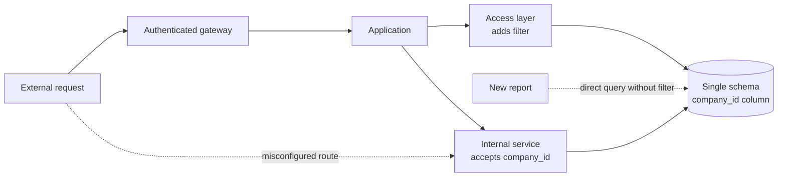

# Secure Boundaries

## Overview

A trust boundary is the point where the level of trust changes: data or calls cross from a less trusted
place to a more trusted one.

Every interesting threat crosses a boundary. Identifying them and defining what is verified at each one is
what turns security from intention into design.

The most common structural mistake: presuming that everything past the first boundary is trustworthy. That
is what makes a small compromise become a total one.

## Problem

The inherited mental model is the castle: a strong wall at the perimeter, and inside everybody is a friend.

It fails because the premise is false: attackers get in, and legitimate employees are already inside. The
full critique of the implicit perimeter is in [zero trust](/10-security/zero-trust.md); what matters here
is the consequence.

Once there, if nothing else verifies anything, the reach is total. The difference between a contained
incident and a catastrophic one is rarely the wall but what exists behind it.

## Core Concepts

### Where the boundaries are

They are not only the network's edge:

```text
internet → application         untrusted input
application → database         credentials, access scope
service → service              service-to-service authentication
regular user → administrative  privilege elevation
tenant A → tenant B            isolation between customers
system → external integration  third-party data
code → third-party dependency  code you did not write
pipeline → production          what can deploy
```

The last four are the least considered: none of them shows up as inbound traffic on a network diagram, and
whoever draws only the perimeter does not see them.

Marking them on a diagram is the main output of a
[threat modeling](/10-security/threat-modeling.md) session.

### Validating at the edge does not excuse validating inside

Edge validation is necessary and insufficient.

It presupposes that **all** input passes through it. One alternative path (a batch process, a fix script,
an internal endpoint, a queue) is enough to break the assumption.

That is why the rule: each component validates what it receives, within its own context. Far from wasted
redundancy, it is what makes the system resist when one path slips through.

And there is a subtle point: **correct validation depends on the context**. The edge validates format; the
domain validates a business rule; the database enforces a constraint. They are different validations, not
the same one repeated.

### Defense in depth is about the reach of the damage

The principle is not "several layers improve the chance of blocking". It is: **when a layer fails — and one
will — what does the next one prevent?**

```text
without depth   the application's credential leaks → access to all the data
with depth      the credential leaks → access limited to that service's scope
                                     → the audit log records it
                                     → anomalous volume fires an alert
                                     → the sensitive data is encrypted with another key
```

Each layer does not prevent the compromise. It reduces what it reaches and the time until it is detected.

That is architecture's most important contribution to security, and it is structural: it is not added
afterward.

### Trusting the caller is the silent failure

An internal service that accepts `user_id` from the caller without verifying whether the caller may act for
that user is delegating authorization to whoever calls.

That works while all the callers are correct. A compromised caller (or a new one, written by somebody who
did not know the premise) passes any identifier.

The rule: **authorization is the responsibility of whoever holds the resource**, not of whoever asks. See
[authorization models](/10-security/authz-models.md).

### Tenant isolation is a boundary, not a filter

In systems serving several customers, separation by a field in the query is the most common implementation
and the most fragile: one query without the filter is enough to leak data between customers.

The more robust boundaries, in order of strength:

```text
a filter in the query                fragile — depends on discipline everywhere
a filter enforced in the access layer  better — one place to get it wrong
a schema or database per customer      strong — the mistake does not reach
an account or environment per customer stronger, more expensive
```

The choice depends on the cost of a leak between customers, and it is practically irreversible after years
of data.

### A boundary with no observation is not a boundary

A check that rejects and does not record prevents that attempt and does not reveal the pattern.

Every relevant boundary should record the denied crossings, and some the accepted ones. It is what allows
detecting a systematic attempt. See [auditability](/10-security/auditability.md).

## Mental Model

**A boundary is where trust changes, and it is never just one.** The architectural work is deciding what is
verified at each one.

## When to Use

Marking the boundaries costs little next to discovering them after an incident; in any system with more
than one level of trust, the marking pays off. The priority of reinforcing them rises when:

- There is sensitive or regulated data.
- The system serves several customers.
- There are external integrations.
- Several teams write code that runs in the same environment.
- The impact of a leak is high.

## When Not to Use

**Inside a single process, between parts that can only reach each other.** Revalidating between two
functions of the same module does not create a boundary: trust does not change there. The check belongs at
the point where the data enters the process.

**A check that repeats the previous one in the same context.** Defense in depth is not accumulating
identical checks: if the next layer verifies exactly what the previous one already enforced, with the same
information, it costs latency and maintenance and prevents nothing new.

**Strong isolation when a leak costs little.** A schema or account per customer in a system whose data is
not sensitive across customers (a public catalog, an internal tool with a few tenants who already know each
other) pays the operational cost in the table below with no matching risk. A filter enforced in the
access layer is enough.

**Logging every accepted crossing on a high-volume path.** Denials need to be logged; every accepted access
on a hot path generates volume nobody reads. Keep logging of accepted crossings for the boundaries where
audit requires it.

## Alternatives

- **[Zero trust](/10-security/zero-trust.md)**: wins when the internal network has stopped being an
  "inside" (cloud, remote work, dozens of services). Instead of marking specific boundaries, it treats every
  request as a crossing. It costs strong identity for every service.
- **Network segmentation**: wins when the boundary is crossed by a protocol the application does not
  control (a legacy database, equipment, a third-party service with no authentication of its own): the
  network enforces what the code cannot. See [network security](/10-security/network-security.md).
- **Isolation by process or by account**: wins when a component runs less trusted code (a plugin, a
  customer workload, a risky dependency): the boundary becomes the operating system's or the provider's,
  not the application's configuration.
- **Per-customer encryption**: wins when the database or backup operator is outside the trust perimeter:
  with access to the data and without the customer's key, nothing is readable. See
  [key management](/10-security/key-management.md).

## Trade-offs

| Many boundaries | Few |
|---|---|
| Contained damage | Broad reach |
| More checks to maintain | Less code |
| Additional latency | Lower |
| More complex diagnosis | Direct |

| Isolation by account | By filter |
|---|---|
| The mistake does not reach | One oversight leaks |
| High operational cost | Low |
| Hard to query across customers | Trivial |

## Failure Modes

**An alternative path with no validation.** A batch, a script, an internal endpoint.

**Authorization delegated to the caller.**

**A customer filter forgotten in a query.**

**The perimeter crossed, nothing else verifies.**

**An internal boundary presumed and nonexistent.** Two services that believe they are isolated share the
same database credential.

**Logging absent.** The attempt happens and nobody knows.

## Common Mistakes

**Presuming the internal side is trustworthy.**

**Validating only at the edge.**

**Accepting the caller's identity without verifying.**

**Isolating customers by filter alone.**

**Not drawing the boundaries.** If they are not on a diagram, they are an
accident, not a decision.

**Not logging denials.**

## Real-World Example

A platform serving 400 corporate customers had a leak between customers: company A viewed company B's data
for three weeks before reporting it.

The cause was a new query, written for a report, with no customer filter. The author did not know it was
needed: nowhere else in the code was the filter explicit, because the access layer added it automatically.
The report used a direct query that bypassed that layer.

The investigation found three absent boundaries:

**Isolation by filter only.** All customers in the same schema, separated by a column.

**A bypassable access layer.** It existed and was not mandatory.

**No detection.** No alert for a user accessing anomalous volume, nor for queries with no customer filter.

And a fourth, found during the fix:

**Internal services trusting the caller.** Four services accepted `company_id` from the caller without
verifying. One of them was reachable through an endpoint that, because of a route configuration error,
answered external requests. That would have allowed accessing any company by passing the identifier.

That had not been exploited, and it was the most serious problem.

The graph shows the system as the investigation found it. Notice that the two dashed paths reach any
customer's data without passing through the only customer check that existed, the access layer.



The fixes, over eight months:

**Isolation by schema.** Each customer came to have its own schema. The migration was expensive and it is
what guarantees that a forgotten query does not reach another customer.

**A mandatory access layer**, with an automated check that refuses direct queries in code review.

**Authorization at the resource holder.** The four services came to derive the company from the token,
never from the parameter.

**Anomalous volume detection** per user and per company.

**Denial logging** at every boundary.

The recorded lesson: the boundary that failed was not the one they watched. The external perimeter was
solid: strong authentication, a gateway, rate limiting. The leak happened entirely **inside** it, between
two legitimate customers, because there was no boundary at all there.

## Related Concepts

- [Threat Modeling](/10-security/threat-modeling.md): where the boundaries are drawn.
- [Zero Trust](/10-security/zero-trust.md).
- [Least Privilege](/10-security/least-privilege.md).
- [Authorization Models](/10-security/authz-models.md).

## Practical Exercise

Draw your system's trust boundaries. For each one, answer: what is verified when crossing, and what happens
if that check fails?

Then look for paths that bypass the edge: batch processes, scripts, queues, internal endpoints. Each one
is a boundary you thought you had.

## Interview Questions

- Why is validating at the edge necessary and insufficient?
- What does defense in depth actually deliver?
- Why can authorization not depend on the identifier sent by the caller?

## Further Reading

- Shostack, Adam. *Threat Modeling: Designing for Security*. Wiley, 2014.
- Saltzer, Jerome; Schroeder, Michael. *The Protection of Information in Computer Systems*, 1975.
- OWASP. *Application Security Verification Standard*.
