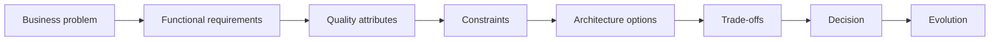

# Software Architecture Mastery

A learning path for Software Engineers who want to think like Software Architects.

The goal is not to teach patterns, frameworks, or cloud services. It is to develop
architectural reasoning: understand the problem, identify constraints, evaluate
alternatives, reason about trade-offs, decide, communicate, and evolve.

:::info Track status

<!-- PROGRESS:INTRO -->
The Portuguese track is complete: **445 of 445 documents**, across all **23 sections**.
<!-- /PROGRESS:INTRO -->

Translation to English is progressive and still early: pages not yet translated
appear in Portuguese. The full plan lives in the
[project specification](https://github.com/oadcavalcante/software-architecture-mastery/blob/main/SPEC.md),
and the detailed state in the
[roadmap](https://github.com/oadcavalcante/software-architecture-mastery/blob/main/ROADMAP.md).

:::

## The seven levels

```text
LEVEL 01 — Foundation
        ↓
LEVEL 02 — Software Design
        ↓
LEVEL 03 — System Design
        ↓
LEVEL 04 — Distributed Systems
        ↓
LEVEL 05 — Architecture
        ↓
LEVEL 06 — Enterprise Architecture
        ↓
LEVEL 07 — Architecture Leadership
```

The corresponding progression of capability:

```text
code → design → systems → distributed systems → architecture → enterprise → strategy
```

Each level assumes the previous one, and the nature of the difficulty shifts along
the way. In the first four it is technical: consistency, latency, coupling,
partial failure. From the fifth onward, the hard part stops being knowing the
right answer and becomes making it happen inside an organization — with budgets,
with teams that disagree, and with a structure that always wins when the
architecture works against it.

## What is here

Twenty-three sections, organized into seven levels plus three cross-cutting
blocks.

**Levels 01 to 04 — the technical base.** Foundation, software design, design
patterns, DDD, system design and distributed systems. This is where the concepts
are built one on top of the other.

**Levels 05 and 06 — architecture and organizational scale.** Data, integration,
cloud, security, scalability, reliability, observability, platform, enterprise
architecture, legacy modernization, documentation, decisions and governance.

**Level 07 — leadership.** Decision-making, influence, communication,
organization, risk, cost and measuring architectural outcomes.

**Cross-cutting.** A whole section on **trade-offs** — fifteen recurring pairs,
each with the real axis of comparison and the conditions under which each side
wins. Fourteen complete **case studies**, from business context to evolution
strategy, each with discarded options and the condition that would make them win.
And the method for **system design interviews**, which is the same reasoning under
time pressure.

## One content rule

No pattern is presented without discussing when **not** to use it.

This is not an editorial preference. A pattern without limits of application is a
recipe, and recipes do not survive the first unanticipated context — which is
exactly the context where architecture matters.

For the same reason, every case study presents more than one viable architecture,
and every discarded option states under which change of constraint it would start
to win. Without that, the material would be retroactive justification of choices
already made.

## Where to start

If you build software and want to understand architecture, start at **Level 01 —
Foundation** in the sidebar and follow the order.

If you are already an architect looking for specific material, **Trade-offs** and
**Case Studies** can be read on their own: the first is fifteen recurring
decisions with the axis that settles each one, and the second is fourteen worked
architectures with the options that were discarded.

If you are preparing for interviews, **System Design Interviews** is the method,
and the case studies are the same reasoning without time pressure.

And **How to use** explains the fixed structure every document follows — the same
in all 437 — which is what makes reading by lookup possible without losing
context.

Sections still awaiting translation are served in Portuguese; the sidebar shows
the full track either way.

## Acceptance test

The material is doing its job when, handed *"Design the architecture for a
high-volume payment platform"*, you do not start drawing boxes — you start asking
what the business problem is, which quality attributes matter, and what
constraints exist.


