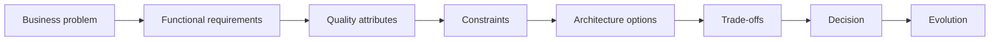

# Software Architecture Mastery

A learning path for Software Engineers who want to think like Software Architects.

The goal is not to teach patterns, frameworks, or cloud services. It is to develop
architectural reasoning: understand the problem, identify constraints, evaluate
alternatives, reason about trade-offs, decide, communicate, and evolve.

:::info Work in progress

<!-- PROGRESS:INTRO -->
This site is being written. **278 of 437 documents** (64%) are done, across **12 of 23 complete sections**.
<!-- /PROGRESS:INTRO -->

Translation to English is progressive: pages not yet translated appear in
Portuguese. The full plan lives in the
[project specification](https://github.com/oadcavalcante/software-architecture-mastery/blob/main/SPEC.md),
and the detailed state in the
[roadmap](https://github.com/oadcavalcante/software-architecture-mastery/blob/main/ROADMAP.md).

:::

## The seven levels

```text
LEVEL 01 — Foundation
        ↓
LEVEL 02 — Software Design
        ↓
LEVEL 03 — System Design
        ↓
LEVEL 04 — Distributed Systems
        ↓
LEVEL 05 — Architecture
        ↓
LEVEL 06 — Enterprise Architecture
        ↓
LEVEL 07 — Architecture Leadership
```

The corresponding progression of capability:

```text
code → design → systems → distributed systems → architecture → enterprise → strategy
```

## Acceptance test

The material is doing its job when, handed *"Design the architecture for a
high-volume payment platform"*, you do not start drawing boxes — you start asking
what the business problem is, which quality attributes matter, and what
constraints exist.


